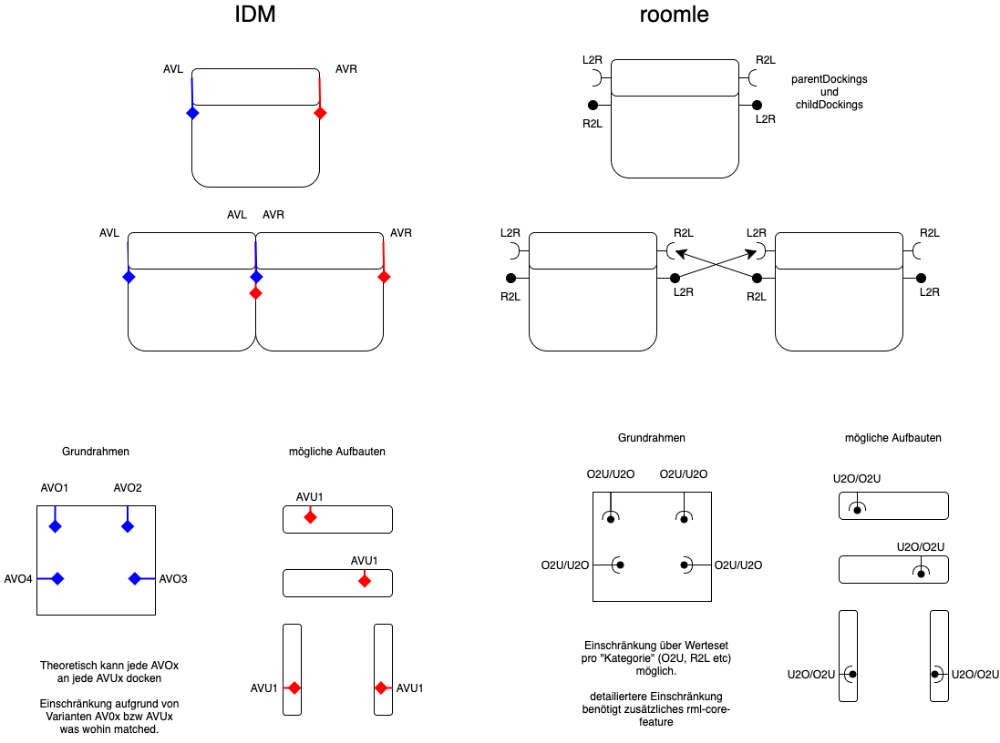

# Docking logic

The IDM format uses SVG files to implement its Magnetplanerzeichnung. Essentially, the SVG file contains a set of lines in 2D space, that if aligned, they allow for 2 components to dock among themselfs. There is also logic for allowing of different heights docks and for special dockings For now we use just the basic left-to-right and right-to-left docking pairs.

## SVG format

The svg file is a xml-style file, meant for 2d graphics. Its structure is made of "g" elements, which have an attribute ID and which can contain either sub-"g" elements, paths (2d-objects or curves) or lines(vector in 2d space). The docking data is contained inside the g-element with id "TE". Inside it there is a set of g-elements, from which the elements with the following ids are taken:

* AVC1 - ( AnschlussvektorCustom1 ) Connection Vector Custom 1
* AVC2 - ( AnschlussvektorCustom2 ) Connection Vector Custom 2
* AVC3 - ( AnschlussvektorCustom3 ) Connection Vector Custom 3
* AVC4 - ( AnschlussvektorCustom4 ) Connection Vector Custom 4
* AVR - ( Anschlussvektor Rechts ) Connection Vector Right
* AVL - ( Anschlussvektor Links ) Connection Vector Left
* AVOx (1-10) - ( Anschlussvektor Oben ) Connection Vector Top
* AVUx (1-10) - ( Anschlussvektor Unten ) Connection Vector Bottom
* AVNx (1-10) - ( Anschlussvektor Nord ) Connection Vector North
* AVSx (1-10) - ( Anschlussvektor Süd ) Connection Vector South

Each of them contains two pairs of coordinates, starting and ending point of a line in 2D space.

This makes it possible to extract the angle and convert the lines to Roomle docking logic, which uses a position in 3D space and a rotation angle for the vector.

## allowed dockings

The allowed docking is generally based on the type of the connectionvector. AVL can dock to AVR, any AVOx can dock to any AVUx and AVNx to AVSx

with 3.1 came OPTIONAL\_CONNECTION in the SERIE. If this is set to 1, within this SERIE the docking is extended such that now Left and North form a "group" and also Right and South. So the allowed docking changes to (AVL and AVNx) can dock to any of (AVR and AVSx)
