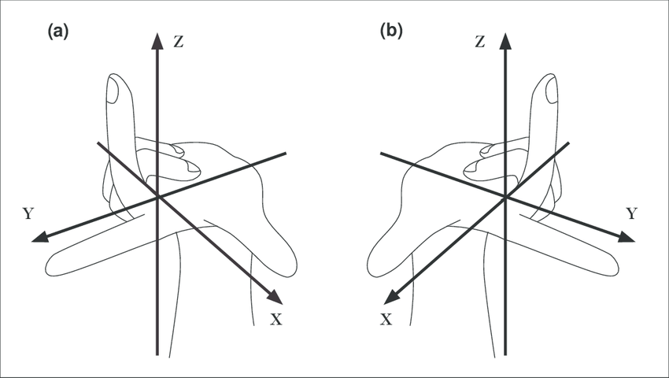

# Roomle Core Coordinate Systems



(a) Left handed coordinate system  
(b) Right handed coordinate system

[wiki - Right-hand rule](https://en.wikipedia.org/wiki/Right-hand_rule)

## Input coordinate system

### Roomle Script Coordinate System

The coordinate system for the component definitions JSON and the configuration JSON is a left handed coordinate system.

```json
{
    "id": "catalog_id:coordinate_system",
    "geometry": "
        AddPrism(1000, Vector2f[{0, 0}, {2000, 0}, {0, 1000}]);
       SetObjSurface('roomle_script_test:yellow');
    "
}
```


### Plan XML Coordinate System

Left handed coordinate system

```xml
<plan version="2">
    <walls>
        <nodes>
            <node rights="0" id="0" x="0" y="2000" z="0" />
            <node rights="0" id="1" x="0" y="0" z="0" />
            <node rights="0" id="2" x="4000" y="0" z="0" />
        </nodes>
        <edges>
            <edge rights="0" from="0" to="1" color="#000000" height="2800" thickness="120" />
            <edge rights="0" from="1" to="2" color="#000000" height="2800" thickness="120" />
        </edges>
    </walls>
    <planobjects />
</plan>
```


#### Object position in PlanXML

Left handed coordinate system


## Internal Roomle Core Coordinate System

### Configurator

Right handed coordinate system


This is also the coordinate system of all the meshes generated by the Configurator

### Planner

Right handed coordinate system


## External Mesh Coordinate System

Right handed coordinate system

```none
o Prism
v 0 0 0
v 2000 0 0
v 0 -1000 0
v 0 0 1000
v 2000 0 1000
v 0 -1000 1000
f 1 2 3 
f 4 6 5 
f 1 3 6
f 1 6 4 
f 2 1 4
f 2 4 5
f 3 2 5
f 3 5 6
```


## API Coordinate System

The API coordinate system is a right handed coordinate system and the same as the internal Roomle Core coordinate system.

- Configurator API
  - Positions and rotations: Right handed, internal Roomle Core coordinate system
  - Meshes: Right handed, internal Roomle Core coordinate system
- Planner API
  - Object positions: Right handed, internal Roomle Core coordinate system
  - Meshes: Right handed, internal Roomle Core coordinate system
