# Roomle Script Language Reference

This document provides a reference for the RoomleScript language, which is contained in the values of the Roomle Component Definition JSON objects and is a proprietary language for scripts interpreted by the Rubens Configurator core.

RoomleScript's syntax is loosely based on the JavaScript language and provides extensive possibilities to use in the component definitions.

## Variables

Variables are declared automatically without any keywords. Type is also assigned automatically and there is no type declaration. To undeclare/delete a variable, which is not a parameter, you can use the [setnull](#setnull) function. Functions [ifnull](#ifnull) and [isnull](#isnull) can be checked if a variable is declared.

**WARNING**
If a variable is accessed before the declaration, it will be interpreted as a String.

Variables can also be declared in the `connection`, `other` and `other_connection` contexts.

Parameters and superseded parameters are accessible by their `key` attribute in the same way as a variable.

The scope of variables is different for different scripts. See [Scopes](#scope-and-context-of-variables) for details.

Example:

- Declare a variable:

```javascript
width = 500; /* width is declared and initialized to value  500 */
```

- Undeclare a variable:

```javascript
setnull(width); /* width is deleted */
if (isnull(width)) {
  /* isnull is true after width has been set to null */
  /* do something */
}
```

- Check if components on both sides of the connection have a width declared and store information about it in this component:

```javascript
self.widthDeclaredOnBothSides = !isnull(self.width) && !isnull(other.width);
```

- Store indices `i` and `j` in the current connection (i.e. in a docking point of a docking range):

```javascript
connection.i = xFromVector(connection.position) / 200;
connection.j = zFromVector(connection.position) / 200;
```

- Work with the index from the other side of the connection:

```javascript
if (!isnull(other_connection.i)) {
  /* do something */
}
```

## Data Types

Data types are assigned automatically. **All types are value types, there are no reference types in RoomleScript**, which is in conformity with the basic concept of the component update process.

Example:

```javascript
arr1 = [10, 20];
arr2 = arr1; /* no reference types => makes copy or arr1 */
pushBack(arr1, 30); /* arr1 is [10, 20, 30] */
pushBack(arr2, 40); /* arr2 is [10, 20, 40] */
```

### Boolean

Values are `true` and `false`. These are internally handled as integers with values `1` and `0`.

Example:

- Boolean variables

```javascript
isRoot = true;
if (isRoot) {
  /* ... */
}
```

```javascript
hasRightArmrest = in(elementType, 'sofa', 'armchair', 'inlinearmrest_right', 'longchair_right');
```

- using advantage of internal data type

```javascript
totalWidth =
  hasLeftArmrest * armrestWidth + width + hasRightArmrest * armrestWidth;
/* which is the same as */
totalWidth =
  (hasLeftArmrest ? armrestWidth : 0) +
  width +
  (hasRightArmrest ? armrestWidth : 0);
```

---

### Integer

Integers are internally handled as the `long` data type. Integers stay integers as long as there is no need to convert them to `float`, for example with floating point functions, like [`fabs`](#fabs). This is important to realize when working with large numbers.

**New in 2023:** In order to keep values stored in Integer type parameters as integers or for defining an integer as an internal value, you can use `i` suffix for numeric literals to force them as integers. Example:

```json
{
    "id": "minexamples:integers",
    "label": "
        label = 'Float literal: ' | 100 | ' Integer literal: ' | 100i;
        // prints: Float literal: 100.00 Integer literal: 100
    ",
    "parameters": [
        {
            "key": "intConst",
            "type": "Integer",
            "defaultValue": 10,
            "label": "
                'intConst: ' | intConst
                // prints: intConst: 10
            ",
            "visible": true
        },
        {
            "key": "fltConst",
            "type": "Decimal",
            "defaultValue": 10,
            "label": "
                'fltConst: ' | fltConst
                // prints: fltConst: 10.00
            ",
            "visible": true
        }
    ]
}
```

---

### float (data type)

Floats are internally handled as single precision floating point numbers (32 bits) and are precise up to about 7 digits.

Any number is considered to be a float by default, unless it has an `i` suffix (i.e. `100i`) or comes from a parameter, which type is `Integer`.

You can use equality operation on floats safely up to three decimal spaces.

Example:

```javascript
1.122 * 2 == 2.244; /* evaluates as true */
1.122 * 2 == 2.245; /* evaluates as false */
/* warning: following are not guaranteed to be precise */
1.12233 * 2 == 2.24466; /* evaluates as true */
1.1224 * 2 == 2.2447; /* evaluates as true (!) */
1.1223 * 2 == 2.2447; /* evaluates as false (!) */
```

---

### String

Strings can be delimited by single `'` or double `"` quotes. However, as the scripts in the JSON files are also delimited with double quotes, those must be escaped `\"`.

It is highly recommended to use single quote delimited strings as the primary choice for obvious reasons.

---

### Arrays

RoomleScript currently newly supports array of all data types. The type of array is determined by the strongest datatype stored inside at the time of initialization. Strength of data types is ascending as follows: `boolean`, `integer`, `float`, `string`.

You can insert a weaker datatype to an array, but you can not insert a value that has a stronger datatype than the array.

Array initialization:

```javascript
arr1 = []; /* empty array */
arr2 = [10, 20]; /* array of consts */
offset1 = 100;
offset2 = 150;
offset3 = 200;
arr3 = [
  offset1,
  offset2,
  offset3,
]; /* arrays initialized by variables by values (not by reference) */
offset1 = 200; /* arr3 stays [100, 150, 200] */
```

Use [`get`](#get) and [`set`](#set) functions for accessing array elements. Use [`stringToArray`](#stringtoarray) to parse a string containing an array (as of 2023, only array of floats is supported in the `stringToArray` function).

---

### Vector2f

A struct for holding a 2D float value. Components of the vectors are accessible via the [`xFromVector`](#xfromvector) and [`yFromVector`](#yfromvector). String containing a Vector2f can be parsed via the [`stringToVector2f`](#stringtovector2f).

Usage:

```javascript
v = Vector2f{100, 200};
```

---

### Vector3f

Usage is the same as Vector2f, just with an extra component accessible via the [`zFromVector`](#zfromvector) function. A String containing a Vector3f can be parsed via the [`stringToVector3f`](#stringtovector3f).

---

## Keywords

### if - else if - else

Usage:

```javascript
if (condition1) {
  /* ... */
} else if (condition2) {
  /* ... */
} else {
  /* ... */
}
```

---

### for

Standard for loop. If script in which the loop is used has a write access, it is recommended to use the local `_` scope prefix.

Usage:

```javascript
for (_.i = 0; _.i < iterations; _.i++) {
  /* ... */
}
```

---

### break

Useful in the `for` loop to immediately exit the current loop.

Usage:

```javascript
for (_.i = 0; _.i < 100; _.i = _.i + 1) {
  if (_.i == 20) {
    break;
  }
}
```

---

### continue

Useful in the `for` loop to immediately skip to the next iteration.

Usage:

```javascript
for (_.i = 0; _.i < length(arr); _.i++) {
  _.v = get(arr, _.i);
  if (_.v == 0) {
    continue;
  }
  pushBack(arr2, _.v);
  countValid++;
}
```

---

### return

Immediately terminates execution of the current script. If script has an internal value to store the result (like `label` or `condition`), you can use return to assign to it.

Usage:

- In a `condition` script

```javascript
condition = true;
if (connection.isPreview && !frontSideIsVisible) {
  return false; /* assigns to `condition` and terminates script */
}
```

- In the `numberInPartList` script

```javascript
if (hasWalls) {
  return wallsCount; /* assigns to `number` and terminates script */
} else {
  number = 0; /* assigns to `number` */
  return; /* terminates script */
}
```

- In any script

```javascript
if (allDone) {
  return; /* terminate immediately */
}
/* or continue doing something */
```

---

## Operators

| Precedence | Operator                             | Description                                           |
| ---------- | ------------------------------------ | ----------------------------------------------------- |
| 1          | `- a`, `+ a`                         | Unary plus and minus                                  |
| 2          | `!a`                                 | Logical NOT                                           |
| 3          | `a++`                                | Suffix/postfix increment                              |
| 4          | `a * b`, `a / b`, `a % b`            | Multiplication, division and modulo                   |
| 5          | `a + b`, `a - b`, `a \| b`           | Addition, subtraction and concatenation               |
| 6          | `a >= b`, `a <= b`, `a > b`, `a < b` | Relational operators < and ≤ and > and ≥ respectively |
| 7          | `a == b`, `a != b`                   | Equality operators = and ≠ respectively               |
| 8          | `a && b`                             | Logical AND                                           |
| 9          | `a \|\| b`                           | Logical OR                                            |
| 10         | `a ? b : c`                          | Ternary conditional                                   |

---

Refer to the [fmod](#fmod) for the floating point modulo function.

## Comments

Commented code is ignored. Meta directives and commands exist. To learn more, refer to [Tools and Importer Meta Keywords](#tools-and-importer-meta-keywords)

### Single line comments

Single line comments can start with `//` or `#`.

```javascript
// this is a single line comment
# this is a single line comment as well
```

**WARNING**
Using single line comments tends to break components while side loading from local drive for testing. For this reason, `//` style comments are converted to `/* */` style comments by the Roomle Component Tool / `roomle-content-tool-api` format function.

---

### Multi-line comments

```javascript
/* 
this is a 
multiline comment 
*/
```

---

## Scope and Context of Variables

The default scope of any internal variable or parameter is the whole current component. Some scripts have read/write access to the component data, some scripts only have read access. To find out which scripts can access which context, you can refer to the [Script Access Rights] chapter.

RoomleScript also provides contexts on several occasions. This is an overview of them:

| prefix              | availability                                                             | purpose                                                                                                                                                                                                    |
| ------------------- | ------------------------------------------------------------------------ | ---------------------------------------------------------------------------------------------------------------------------------------------------------------------------------------------------------- |
| _nothing_           | current component if script has WRITE access, otherwise current script   |                                                                                                                                                                                                            |
| `_.`                | local - current script                                                   | Use this for local helper variables. Variable will be set to null after current script finishes.                                                                                                           |
| `parameter.`        | `onValueChange` and `onUpdate` script of the parameter                   | provides `userTriggeredChange : boolean` getter                                                                                                                                                            |
| `other.`            | all scripts in connections (`onUpdate`, `condition`, `assigmentScripts`) | access to all parameters and internal vars of the component on the other side of the connection                                                                                                            |
| `self.`             | all scripts in connections (`onUpdate`, `condition`, `assigmentScripts`) | actually is redundant, but helps to understand the code unambigously and should be used whenever `other.` is used                                                                                          |
| `connection.`       | all scripts in connections (`onUpdate`, `condition`, `assigmentScripts`) | provides `index`, `position`, `isPreview` There are two connections in one docking/sibling point dock pair, one on each side. You can store and read variables relevant to the connection at the self side |
| `other_connection.` | all scripts in connections (`onUpdate`, `condition`, `assigmentScripts`) | Same as before, but targets the other side of the connection.                                                                                                                                              |

---

## Internal values

Some scripts have internal values defined. See the table and their purpose:
|identifier|context|purpose|
|---|---|---|
|articleNr|articleNr script|sets the current component's article number|
|`number`|subComponent.numberInPartList|sets the subcomponent's count of entries in the part list|
|`connection.isPreview`|docking condition|read-only, returns true if in docking preview state|
|`connection.index`|docking range|returns the index of the docking point in the range array|
|`connection.position`|docking range, line|returns Vector3f position of the child relative to the parent's coordinate system|
|`condition`|all conditions|sets the result of the condition|
|`label`|all label scripts|Has value from the `labels` map in the current language. Overwrite with value based on the script|
|`language`|all label scripts|Getter for the language ISO code of the current locale the configurator runs with.
|`parameter.userTriggeredChange`|`parameter.onValueChange` script|getter to determine if the user has just interacted with this parameter|

---

## Functions

As of beginning of 2024, RoomleScript has a possibility to declare custom functions. As of Q2 2024, component scoped functions are provided.

Every function in RoomleScript is executed in the context of the script from which the function has been called. Therefore, functions can get or set values with the same rights as the script from which the function has been called. If a variable or a parameter exists and gets assigned in the scope of the function, its value is overwritten. Based on the access rights of the script, the variable is either changed for the current script only or for the whole component (the `self` context). If the script doesn't have write access rights, the parameter or variable get shadowed with a local variable. If no parameter or no variable in the scope of the function exists and there is an assignment to a new variable, it will be declared as an internal varaible of the function.

Function's parameters are always declared for the function and should not shadow variables or parameters in the scope where the function resides (be it a component.function or local function). A warning will be thrown if this is the case.

Functions can be nested (functions called within other functions), but can not be recursive (function calls the itself directly or indirectly).

**Recommendation:** Always use the context when working with function. Always use `_.` or `self.` prefixes inside the functions. This will avoid errors caused by suddenly adding a conflicting variable in the future. Let only the function's parameters stay without the context.

### Component Functions

Functions can be declared in the `component.functions` array. Such functions are then declared for the whole component and accessible based on their `type` attribute. Based on core-provided functions or contexts in the function, either of the four types have to be specified. Complex functionality can be defined for the component, which can save a lot of repeating code and related coding problems and also enables an API-like design approach to component creation.

```json
{
    "id": "example:function",
    "functions": [
        {
            "key": "SumOfTwoNumbers",
            "type": "default",
            "arguments": [
                {
                    "key": "a"
                },
                {
                    "key": "h"
                }
            ],
            "script": "return a + b;"
        }
    ],
    "onUpdate": "
        self.x = SumOfTwoNumbers(100, 200);
    "
}
```

The attributes of a `function` object are:

- `key` The identifier of the function that will be used for calling it.
- `type`
  - `default` if not set, this is the default value. Useful for functions that do general computations.
  - `geometry` Required for functions containing geometry objects calls, like AddCube function
  - `changeable` Supports `setBoxForMeasurement`, `setVisible`, `setEnabled`
  - `onUpdate` Supports requestDockItem and `changeable` functions
  - `collisionCondition` For accessing the collisionCondition functions are getters that are available in the `connection.collisionCondition` script: `getBoxOrigin`, `getBoxSize`, `getBoxForMeasurementOrigin`, `getBoxForMeasurementSize`
- `arguments` Array of function parameters:
  - `key` The key to access the argument inside the function
  - `defaultValue` If set, the argument is non-mandatory in the function call (the defaultValue is used instead) and also allows using a keyword argument.
- `script` The body of the function. The keyword `return` terminates the function and if a value follows, it is returned.

Following function `Sum` can be called with any amount of arguments up until 5, i.e. `Sum(1, 2)` or `Sum(1, 2, 3, 4, 5)`.

```json
{
    "key": "Sum",
    "type": "default",
    "arguments": [
        {
            "key": "num0",
            "defaultValue": 0
        },
        {
            "key": "num1",
            "defaultValue": 0
        },
        {
            "key": "num2",
            "defaultValue": 0
        },
        {
            "key": "num3",
            "defaultValue": 0
        },
        {
            "key": "num4",
            "defaultValue": 0
        }
    ],
    "script": "
        return num0 + num1 + num2 + num3 + num4;
    "
}
```

Following function call uses the **keyword arguments**:

```json
{
    "id": "tests:componentfunctions",
    "functions": [
        {
            "key": "AddBoardWithHole",
            "type": "geometry",
            "arguments": [
                {
                    "key": "cubeSize"
                },
                {
                    "key": "cubeColor",
                    "defaultValue": "isdt:wood_oak"
                },
                {
                    "key": "holeDiameter",
                    "defaultValue": 100
                },
                {
                    "key": "holeColor",
                    "defaultValue": "testing101:mr_chipboard"
                }
            ],
            "script": "
                _.w = cubeSize;
                _.h = 30;
                _.d = cubeSize / 2;
                AddCube(Vector3f{_.w, _.d, _.h});
                 SetObjSurface(cubeColor);

                if (holeDiameter < _.d) {
                    _.r = holeDiameter / 2;
                    AddCylinder(_.r, _.r, 2 * _.h, 16);
                     MoveMatrixBy(Vector3f{_.w / 2, _.d / 2, 0});
                     SetObjSurface(holeColor);
                    MinusOperator();
                }
            "
        },
        {
            "key": "Array_Sum",
            "type": "default",
            "arguments": [
                {
                    "key": "array"
                }
            ],
            "script": "
                _.sum = 0;
                for (_.i = 0; _.i < length(array); _.i = _.i + 1) {
                    _.sum = _.sum + get(array, _.i);
                }
                return _.sum;
            "
        }
    ],
    "onUpdate": "
        self.sum = Array_Sum([100, 400, 500]);
    ",
    "geometry": "
        AddBoardWithHole(self.sum, 'isdt:black', 400, 'isdt:white');

        AddBoardWithHole(self.sum);
         MoveMatrixBy(Vector3f{self.sum, 0, 0});

        AddBoardWithHole(self.sum, holeColor = 'isdt:yellow'); // keep cubeColor and holeDiameter default, set holeColor
         MoveMatrixBy(Vector3f{2 * self.sum, 0, 0});
    "
}
```

### SubComponent Functions

If `component.functions` are defined, they can be accessible in the subComponent. Keep in mind, that the functions are evaluated not in the subComponent, but in the current component, as if they were just copied to the current component's `functions` array. In this case, the functions should be prefixed with the subComponent's `internalId`. See following example where the functions are referred and used by another component.

```json
{
    "id": "tests:subcomponentfunctions",
    "subComponents": [
        {
            "internalId": "Functions",
            "componentId": "tests:subcomponentfunctions",
            "active": false
        }
    ],
    "onUpdate": "
        self.sum = Functions.Array_Sum([100, 400, 500]);
    ",
    "geometry": "
        Functions.AddBoardWithHole(self.sum, 'isdt:black', 400, 'isdt:white');

        Functions.AddBoardWithHole(self.sum);
         MoveMatrixBy(Vector3f{self.sum, 0, 0});

        Functions.AddBoardWithHole(self.sum, holeColor = 'isdt:yellow');
         MoveMatrixBy(Vector3f{2 * self.sum, 0, 0});
    "
}
```

Notice, that the subComponent is not active. If a subComponent only carries functions or data and is not expected to be a part list entry or a geometry subComponent, there is no point for it to remain active.

Such feature allows you to create a component with a library of functions that can be linked to other components.

However, if the functions in the subComponent are nested, they need to be called in the correct context, which is a complication and will be solved with a feature in the future.

### Custom Local Functions

Local functions can be defined using the `function` keyword, very similarly as it is done in JavaScript. Local functions are valid only in the script where they are declared and all calls of it must be done behind its declaration.

Examples:

```javascript
x = getFive(); // error, function is used before its declaration

function getFive() {
  return 5;
}

y = getFive(); //
```

```json
{
    "onUpdate": "
        function add(a, b) {
            return a + b;
        }
    ",
    "geometry": "
        AddCube({add(2 + 3) * 100, 100, 100}); // error - function add is not declared in the geometry script
    "
}
```

```json
{
    "id": "tests:functions",
    "parameters": [
        {
            "key": "num",
            "type": "Integer",
            "visible": true,
            "validValues": [
                1,
                2,
                5
            ]
        }
    ],
    "onUpdate": "
        function setNum(n) {
            self.num = n;
        }
        setNum(2); // will set the parameter num to 2
    ",
    "geometry": "
        AddCube({self.num * 1000, 1000, 1000}); // result: 2000, 1000, 1000

        function setNum(n) { // function declarations will not conflict since they are local; this is, however, not a good practice
            self.num = n;
        }
        setNum(5); // will not set the parameter num to 5, instead will create a internal variable in the geometry script under the identifier num which shadows the parameter from that place on

        AddCube({self.num * 1000, 1000, 1000}); // result: 5000, 1000, 1000
         MoveMatrixBy({0, 1000, 0});
    "
}
```

---

## Constants

| Constant     | Value     | Meaning                                                                       |
| ------------ | --------- | ----------------------------------------------------------------------------- |
| `M_E`        | `2.71828` | Euler constant                                                                |
| `M_LOG2E`    | `1.44270` | base 2 logarithm of `M_E`                                                     |
| `M_LOG10E`   | `0.42429` | `log10(M_E)`                                                                  |
| `M_LN2`      | `0.69315` | `log(2)`                                                                      |
| `M_LN10`     | `2.30259` | `log(10)`                                                                     |
| `M_PI`       | `3.14159` | π                                                                             |
| `M_PI_2`     | `1.57080` | `M_PI / 2`                                                                    |
| `M_PI_4`     | `0.78540` | `M_PI / 4`                                                                    |
| `M_1_PI`     | `0.31831` | `1 / M_PI`                                                                    |
| `M_2_PI`     | `0.63622` | `2 / M_PI`                                                                    |
| `M_2_SQRTPI` | `1.12838` | `2 / sqrt(M_PI)`                                                              |
| `M_SQRT2`    | `1.41421` | `sqrt(2)`                                                                     |
| `M_SQRT1_2`  | `0.70711` | `sqrt(2) / 2` or `sin(M_PI / 6)` or sine of 30 degrees / cosine of 60 degrees |

Convert degrees to radians: `a * M_PI / 180`

Convert radians to degrees: `a * 180 / M_PI`

---

## Available Functions

List of available functions in all RoomleScripts of the component definition.

### acos

`(a: float) : float`

Arcus cosine (arccosine)

Parameters:

- `a`: float value between -1 and 1

Returns: arccosine of `a` in radians.

Usage:

```javascript
v = 0.5;
angleRad = acos(v); /* returns 1.04719755 */
angle = (angleRad / M_PI) * 180; /* 60 */
```

---

### activeGroupInView

`() : String`

Queries the configurator UI to get the currently selected parameter group. This is useful for manipulating geometry based on what the user is configuring.

Returns: `key` property of the current parameter group

Usage:

- onUpdate:

```javascript
displayOpenDoor = activeGroupInView() === 'grpInternalEquipment';
```

- geometry:

```javascript
AddCube(Vectorf3{doowWidth, doorThickness, doorHeight});
if (displayOpenDoor) {
    /* rotate the door to visualize it is open */
    RotateMatrixBy(Vector3f{0, 0, 1}, Vector3f{0, 0, 0}, 105);
}
```

---

### asin

`(a: float) : float`

Arcus sine (arcsine)

Parameters:

- `a`: value between -1 and 1

Returns: arcsine of `a` in radians.

Usage:

```javascript
v = 0.5;
angleRad = asin(v); /* returns 523598776 */
angle = (angleRad / M_PI) * 180; /* 30 */
```

---

### atan

`(a: float) : float`

Arcus tangent.

Parameters:

- `a`: value between -1 and 1

Returns: arctangent of `a` in radians.

---

### atan2

`(y: float, x: float) : float`

Arcus tangent defined by ratio of opposite and adjacent side of the triangle.

Parameters:

- `y`: length of opposite side
- `x`: length of adjacent side

Returns: arctangent of the angle in radians.

---

### ceil

`(number: float, digits: float) : float`

Nearest higher value

Parameters:

- `number`: the number to be ceiled
- `digits`: count of decimal digits

Returns: Nearest higher value rounded to given amount of decimal spaces.

Usage:

```javascript
x = 123.4567;
ceil(x, 0); /* returns 124 */
ceil(x, 2); /* returns 123.46 */
```

---

### cos

`(valueRad: float) : float`

Cosine

Parameters:

- `valueRad`: value in radians

Returns: cosine value of `a`.

---

### cosh

`(valueRad: float) : float`

Hyperbolic cosine

Parameters:

- `valueRad`: value in radians

Returns: hyperbolic cosine value of `a`.

---

### exp

`(x: float) : float`

Exponential function

Parameters:

- `x`: the exponent

Returns: Value of e powered to `x`

---

### fabs

`(x: float) : float`

Absolute value

Parameters:

- `x`: value

Returns: `x` if `x` is positive or `-x` if x is negative.

Usage:

```javascript
fabs(5); /* returns 5 */
fabs(-5); /* returns 5 */
```

---

### float

`(value: any) : float`

Convert to float

Parameters:

- `value` the value to try to convert to float

Returns: If `value` starts with number, returns the first parsed number, otherwise 0.

Usage:

```javascript
float('5'); /* returns 5.0 */
float('5 hello 3432'); /* returns 5.0 */
float('5.3'); /* returns 5.3 */
float('5,3'); /* returns 5.0 */
float(' 5'); /* returns 5.0 */
float('_5'); /* returns 0.0 */
float([5]); /* returns 0.0 */
float([1]); /* returns 0.0 */
float(Vector3f{5,5,5}) /* returns 0.0 */
```

---

### floor

`(number: float, digits: float) : float`

Nearest lower value

Parameters:

- `number`: the number to be floored
- `digits`: count of decimal digits

Returns: Nearest lower value rounded to given amount of decimal spaces.

Usage:

```javascript
x = 123.4567;
floor(x, 0); /* returns 123 */
floor(x, 2); /* returns 123.45 */
```

---

### fmod

`(dividend: float, divisor: float) : float`

Floating point modulo

Parameters:

- `dividend`: float
- `divisor`: float

Returns: Modulo as float.

**Warning**
Works well only with integers that can be represented by single precision floating point numbers (32 bits, up to around 7 digits).

Usage:

```javascript
fmod(13, 4); /* returns 1 */
fmod(12, 4); /* returns 0 */
fmod(123456789, 1234567); /* will not work well */
```

---

### get

`(array: [float], index: Integer) : float`

Reads an array element at a given index.

To write an array element, refer to [set](#set).

Parameters:

- `array`: the array you want to access
- `index`: index of the element in the array, index of the first element is zero `0`
  - ⚠️ float indices will floor to the next lower integer

Returns: The number from the array at the given index or 0 if fails.

Throws:

- `[1404]` Index out of bounds. Returns 0 in this case, execution continues

Usage:

```javascript
arr = [10, 20, 30, 40];
get(arr, 2); /* returns 30 */
get(arr, 2.9); /* returns 20 */
get(arr, 2.999999); /* returns 20 */
get(
  arr,
  2.9999999
); /* returns 30 (floating point precision flips to index 3) */
get(arr, 5); /* returns 0, throws 1404 */
get(arr, -1); /* returns 0, throws 1404 */
```

---

### getComponentProperty

`(propertyKey: 'runtimeId' | 'externalId' | 'catalogId', runtimeId*: integer) : integer | string`

Returns the unique runtime id, or component Id of the current component. If this function is used in a `collisionCondition` script, such a property of another colliding component can be retrieved.

Note: parts of an ID are `catalogId:externalId`

Parameters:

- `propertyKey` either `runtimeId`, `externalId` or `catalogId` string values
- `runtimeId` a runtime ID of a different component, only availabe in the `collisionCondition`

Returns:

- unique runtime ID as an integer
- external or catalog ID as a string

Usage:

```javascript
id = getComponentProperty('runtimeId'); // equivalent to getUniqueRuntimeId()
componentId =
  getComponentProperty('catalogId') | ':' | getComponentProperty('externalId');
```

```json
"collisionCondition": "
    for (i = 0; i < length(collidingComponentIDs); i++) {
        collidingComponentId = get(collidingComponentIDs, i);
        // avoid collision with the catalog:shelf component
        if (getComponentProperty('externalId', collidingComponentId) == 'shelf') {
            return false;
        }
    }
    return true;
"
```

---

### getDockPosition

`() : Vector3f`

Get position of child docking point in the coordinate system of the parent.

Returns: Vector from parent origin to child docking point or zero Vector3f if component is the root component.

See [getPosition](#getposition) for more details.

---

### getDockPositionRelativeToParentDock

`() : Vector3f`

Get position of the child docking point in the coordinate system of the parent relative to the parent docking point.

Returns:

- point - point: ideally zero Vector3f or the offset if configuration doesn't reload properly
- range - point: ideally zero Vector3f or the offset if configuration doesn't reload properly
- line - point: Vector from the beginning of the dockLine to the child docking point
- root: zero Vector3f

---

### getMaterialProperty

`(materialId: String, propertyName: String, fallback: String) : String`

Retrieves additional material data defined in material properties. See [Using GetMaterialPropery Function](200_140_getmaterialproperty.md) for detailed description.

Parameters:

- `materialId`: Id of the target material
- `propertyName`: name of the property on the given material
- `fallback`: Value to return if material or property are missing

Returns: the value stored in the material property or fallback if no material is found or if the material doesn't have the property.

Usage:

- exmaple material entry:

```json
{
    "externalIdentifier": "fabric_blue",
    "id": "isdt:fabric_blue",
    "properties": {
        "pricegroup": "30"
    },
    ...
}
```

```javascript
getMaterialProperty('isdt:fabric_blue', 'pricegroup', 'NULL'); /* returns '30' */
getMaterialProperty('isdt:fabric_blue', 'type', 'NULL'); /* returns 'NULL' */
getMaterialProperty('doesnt:exist', 'something', 'NULL'); /* returns 'NULL' */
```

---

### getPosition

`() : Vector3f`

Get position of the child component in the coordinate system of the parent.

Returns: Vector3f leading from parent component origin to child component origin or zero Vector if component is the root component.

Usage:

```javascript
position = getPosition();
parentOrigin = Vector3f{
    - xFromVector(position),
    - yFromVector(position),
    - zFromVector(position)
};
```

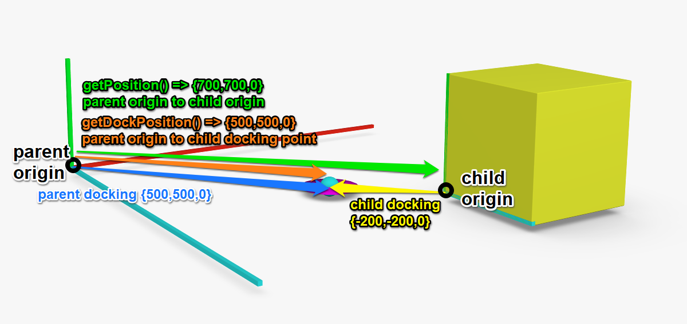

---

### getUniqueRuntimeId

`() : Integer`

Returns unique runtime ID that has been assigned to this component instance in the configurator. Every root component, child component and subComponent will have an unique number. This number is not reused after for example deleting components. It is not persistent between configuration instances. Can be used to determine the timing order in which the components have been added to the configuration.

It is useful as a decision factor between two components connected via sibling points in cases that no other way to choose one component from more.

This number is not persistent between configurator instances (i.e. after configuration reload or between undo/redo actions) and in most cases, storing it as a parameter makes no sense and can lead to errors.

Example: See the [Quadpost Shelf System template](400_30_quadpost.md)

Returns: Integer representing the unique runtime ID of the component in the configuration.

Usage:

```javascript
/* in onUpdate */
if (isnull(uid)) {
  /* enter only in the first onUpdate call */
  uid = getUniqueRuntimeId(); /* could be for example 7 */
}
/* in a siblingPoint.assignmentScripts.onUpdate script to determine owner of the shared wall */
if (self.height > other.height) {
  self.hasSharedWall = true;
} else if (self.height < other.height) {
  self.hasSharedWall = false;
} else {
  self.hasSharedWall = self.uid > other.uid;
}
```

---

### ifnull

`(variable: any, fallback: any) : any`

Checks if a variable is undefined or null and returns the variable or fallback. Useful for making sure a variable is defined.

Parameters:

- `variable`: the variable to check for null
- `fallback`: a value to return if varialbe is null or undefined

Returns:

- either the `variable` or the `fallback` if `variable` is null

Usage:

```javascript
/* checks if variable 'initialized' is null and if yes, returns true in order to enter the block */
if (ifnull(initialized, true)) {
  /* make sure to initialize in order to enter only once */
  initialized = true;
}
```

---

### in

`(valueToCheck: any, value1: any, value2: any, ...) : boolean`

Useful for checking if a list of values containes a specific value.

Parameters:

- `valueToCheck`: the value that is being searched for in the list
- `valueN`: any number of arguments that will form the list

Returns

- `true` if valueToCheck is equal to at least one of the other values, otherwise `false`

Usage:

```javascript
fruit = 'banana';
isFruit = in(fruit, 'apple', 'banana', 'cherry');       /* true */
pearIsValid = in('pear', 'apple', 'banana', 'cherry');  /* false */
```

Most used to compare a variable to a list of constants, however you can also check a constant to a list of variables.

```javascript
/* check if at least one of variables is true */
isGroceryItem = in(true, isFruit, isVegetable, isDairy);
/* which is actually equivalent to */
isGroceryItem = (isFruit + isVegetable + isDairy) > 0;
```

---

### inArray

`(searchedValue: float, array: [float]) : Boolean`

Checks if array contains a value.

Arguments

- `searchedValue`: the value that is being looked for
- `array`: the array to check

Returns: True if array contains the value.

Usage:

```javascript
inArray(1, [1, 2, 3, 1]); /* returns 1 */
inArray(10, [1, 2, 3, 1]); /* returns 0 */
```

---

### indexOf

`(searchedValue: float, array: [float]) : Integer`

Find index of a value in an array.

Parameters:

- `searchedValue`: the value that is being looked for
- `array`: the array to search

Returns: Index of the first occurence of the value in the array or -1 if no occurence.

Usage:

```javascript
indexOf(1, [1, 2, 3, 1]); /* returns 0 */
indexOf(10, [1, 2, 3, 1]); /* returns -1 */
```

---

### insert

`(array: [float], index: Integer, value: float | [float]) : void`

Insert into array in front of the element at given index

Parameters:

- `array`: array into which the values are inserted
- `index`: index of the element before which the values will insert
- `value`: value to be inserted, can be a number or an array of numbers

Throws:

- `[1404]` index out of bounds

Usage:

```javascript
arr = [10, 20];
insert(arr, 1, 15); /* arr is [10, 15, 20] */
insert(arr, 0, [0, 5]); /* arr is [0, 5, 10, 15, 20] */
insert(arr, 5, 25); /* arr stays [0, 5, 10, 15, 20], throws [1404] */
insert(arr, -1, 5); /* arr stays [0, 5, 10, 15, 20], throws [1404] */
```

---

### intersection

`(a: [float], b: [float]) : [float]`

Intersection of arrays

Parameters:

- `a`, `b`: two arrays of numbers

Returns: Array with elements that are present in both arrays.

Usage:

```javascript
intersection([3, 2, 1], [2, 3, 4, 5]); /* returns [2, 3] */
intersection([3, 2, 1], [5, 4, 3, 2]); /* returns [3, 2] */
intersection([1, 2, 3], [4, 5, 6]); /* returns [] */
intersection([1], [1, 1, 1]); /* returns [1, 1, 1] */
intersection([1, 1, 1], [1]); /* returns [1, 1, 1] */
```

---

### isEnabled

`(parameterKey: String) : Boolean`

Returns if a parameter is enabled.

Parameters:

- `parameterKey`: key of the parameter

Returns: True if the parameter exists and its `enabled` flag is true, false otherwise.

Usage:

```javascript
if (isVisible(depth)) {
  actualDepth = depth;
} else {
  /* do not take the depth parameter value but a fallback */
  actualDepth = 700;
}
```

---

### isnull

`(value: any) : Boolean`

Checks for null values.

Parameters:

- `value`: identifier to be checked

Returns: True if identifier is undeclared, null or after setnull call.

Usage:

- initialize on component load, at the beginning of onUpdate

```javascript
if (isnull(initialized)) {
  initialized = true;
  /* initialize values here */
}
```

- in a connection script of a docking range:

```javascript
/* compute indeces of the docking point */
if (isnull(connection.i)) { connection.i = xFromVector(connection.position) / > offset; }
if (isnull(connection.j)) { connection.j = yFromVector(connection.position) / > offset; }
```

---

### isVisible

`(parameterKey: String) : Boolean`

Returns if a parameter is visible.

Parameters:

- `parameterKey`: the parameter key to get the visible flag value from

Returns: True if the parameter exists and its `enabled` flag is true, false otherwise.

Usage:

```javascript
if (isVisible(depth)) {
  actualDepth = depth;
} else {
  /* do not take the depth parameter value but a fallback */
  actualDepth = 700;
}
```

---

### length

`(array: [float])`

Length of array (for the length of a String, refer to [size](#size)).

Parameters: \* `array`: array of floats

Returns: count of the array elements.

Usage:

```javascript
a = [];
b = [0, 1, 2];
c = [0];
length(a); /* returns 0 */
length(b); /* returns 3 */
length(c); /* returns 1 */
```

---

### like

`(input: String, pattern: String) : Boolean`

Returns true if input matches the pattern. The pattern is a String with placeholders for one any single character or any subString.
This is the `OPTION_LIKE` operator from the IDM 3.1 standard, which itself is based to be similar on the SQL's `LIKE` operator.

Parameters:

- `input`: the String to check against the pattern
- `pattern`: a case sensitive String pattern, where `_` is a wildcard for any single character and `%` is a wildcard representing any subString at least 1 character long
  - `a_` - length 2, starts with `a`
  - `a%` - any String starting with `a`
  - `_a` - length 2, ends with `a`
  - `%a` - any String that ends with a
  - `%a%` - any String that contains `a`

Returns: `true` if String matches to the pattern, otherwise `false`

Usage:

```javascript
like('Hello beautiful world', 'Hello'); /* false; no wildcard, pattern means equls to 'Hello' */
like('Hello beautiful world', 'Hello%'); /* true; pattern means starts with 'Hello' */
like('Hello beautiful world', '%beatiful%'); /* true; pattern means contains 'beatiful' */
like('Hello beautiful world', '%Hello%'); /* false; pattern means contains 'Hello' which is preceded and followed by other characters */
like('Hello beautiful world', 'Hello%world'); /* true; pattern means starts with 'Hello' and ends with 'world' */
like('Hello beautiful world', 'h%'); /* false; pattern means starts with 'h' */
```

---

### log

`(value: float) : float`

Natural logarithm

Parameters:

- `value`

Returns: Logarithm of the value with base of `e` (~2.718)

Usage:

```javascript
log(100); /* returns ~4.605 */
log(M_E); /* returns 1 */
log(1); /* returns 0 */
log(0); /* returns -inf */
```

---

### log10

`(value: float) : float`

Common logarithm

Parameters:

- `value`

Returns: Logarithm of the value with base of 10

Usage:

```javascript
log10(100); /* returns 2 */
log10(M_E); /* returns ~0.434 */
log10(1); /* returns 0 */
log10(0); /* returns -inf */
```

---

### popBack

`(array: [float]) : float`

Returns and removes last number from array.

Parameters:

- `array`

Returns: Last number of array, original array has this value removed or 0 if `[1405]` is thrown.

Throws:

- `[1405]`: popBack empty array

Usage:

```javascript
arr = [10, 20];
x1 = popBack(arr); /* returns 20, arr is [10] */
x2 = popBack(arr); /* returns 10, arr is [] */
x3 = popBack(arr); /* returns 0, arr is [], throws [1405] */
```

---

### pow

`(value: float, exponent: float) : float`

Power function

Parameters:

- `value`: the value to compute power
- `exponent`

Returns: value powered to exponent.

---

### pushBack

`(array: [float], value: float) : void`

Pushes a value at the end of an array.

Parameters:

- `array`: the array to which to push
- `value`: the value to push

Usage:

```javascript
arr = [];
for (_.i = 0; _.i < 5; _.i = _.i + 1) {
  pushBack(arr, 0);
}
/* arr is [0, 0, 0, 0, 0] */
```

---

### removeAt

`(array: [float], index: Integer) : float`

Remove element at index from an array and return the next.

Parameters:

- `array`: the array from which the element should be removed
- `index`: index at which to remove the element, first index is 0

Returns: Next element after the one that has been removed or 0 if the element is the last one or if `[1404]` has been thrown.

Throws:

- `[1404]`: Index out of bounds

Usage:

```javascript
arr = [10, 20, 30, 40, 50];
x1 = removeAt(arr, 2); /* returns 40, arr is [10, 20, 40, 50] */
x2 = removeAt(arr, 3); /* returns 0, arr is [10, 20, 40] */
x3 = removeAt(arr, 3); /* returns 0 and throws 1404, arr stays as it is */
x3 = removeAt(arr, -1); /* returns 0 and throws 1404, arr stays as it is */
```

---

### requestDockItem

`(configuration: string, parentDockPointPosition: Vector3f, childDockPointPosition: Vector3f)`

Sends a docking request to the configurator. After the current update call will have been finished, a docking of the defined configuration will happen. Connection and child component will be available in the next update call. Because the docking does not happen in the configurator kernel, compatible version of the SDK has to be used in custom integration for this function to be available. You need to define which docking points to use on both side by their positions.

This function is only valid in the main `onUpdate` script and must be inside an if-block.

Parameters:

- `configuration` Either an itemId or a stringified configuration JSON that should dock.
- `parentDockPointPosition` Vector3f containing coordinates of a valid docking point on the parent side.
- `childDockPointPosition` Vector3f containing coordinates of the child docking point.

Hint: To find out the correct arguments, you can do the docking manually and then check the configuration (which can be achieved by calling `RoomleConfigurator.getCurrentConfiguration()` or by using the interface buttons of the Rubens CLI). The parent docking point argument is the `dockPosition` of the child component, the child docking point is the `dockChild` value of the child component.

Usage:

```javascript
requestDockItem('catalog:itemId', Vector3f{width / 2, 0, 0}, Vector3f{ -300 /* -width/2 of the child */, 0, 0 });
requestDockItem('{\"componentId\":\"catalog:componentId\"}', Vector3f{width / 2, 0, 0}, Vector3f{ -300 /* -width/2 of the child */, 0, 0 });
```

---

### round

`(number: float, digits: float) : float`

Nearest rounded value

Parameters:

- `number`: the number to be rounded
- `digits`: count of decimal digits

Returns: Nearest value rounded to given amount of decimal spaces.

Usage:

```javascript
x = 1.234567;
round(x, 0); /* returns 1 */
round(x, 1); /* returns 1.2 */
round(x, 2); /* returns 1.23 */
round(x, 3); /* returns 1.235 */
round(x, 4); /* returns 1.2346 */
```

---

### set

`(array: [float], index: Integer, value: float) : void`

Sets value of an array element at a given index.

Parameters:

- `array`: the array you want to set
- `index`: index of the element in the array, index of the first element is zero `0`
  - ⚠️ float indices will floor to the next lower integer
- `value`: the new value that will replace the old value

Throws:

- `[1404]` Index out of bounds.

Usage:

```javascript
arr = [1, 2, 3];
set(arr, 0, 5); /* [5, 2, 3] */
set(arr, 1, get(arr, 2)); /* [5, 3, 3] */
set(arr, 2, get(arr, 2) + 1); /* [5, 3, 4] */
```

---

### setBoxForMeasurement

`(size: Vector3f, position: Vector3f) : void`

Overrides the bounding box of the geometry in order to change the measurements.

⚠️ This is only valid if called in `onUpdate`

Parameters:

- `size`: defines the size of the bounding box
- `position`: position of the left rear bottom corner of the box

Hint: This behaves like a combination of [AddPlainCube](#addplaincube) and [MoveMatrixBy](#movematrixby). Refer to the [Dimensioning](200_120_dimensioning.md#measurement-box) chapter for more information and examples.

Usage:

```javascript
setBoxForMeasurement(Vector3f{1600, 800, 670}, Vector3f{-800, 0, 0});
```

---

### setEnabled

`(parameterKey: String, enable: Boolean) : void`

Sets and overrides the `enabled` flag of the parameter with the given key. This applies for the update loop in which this call is done.

Parameters:

- `parameterKey`: key of the parameter
- `value`: final status of the `enabled` flag

Usage:

```json
"parameters": [
    {
        "key": "width",
        "type": "Decimal",
        "defaultValue": 100,
        "unitType": "length",
        "enabled": true,
        "validValues": [100, 200, 300]
    }
],
"onUpdate": "setEnabled('width', false) /* disables the width parameter */"
```

---

### setnull

`(variable: any) : void`

Undeclares a variable of given name.

Usage:

```javascript
setnull(x);
if (isnull(x)) {  /* true */
   ...
}
```

---

### setVisible

`(parameterKey: String, enable: Boolean) : void`

Sets and overrides the `visible` flag of the parameter with the given key. This applies for the update loop in which this call is done.

Parameters:

- `parameterKey`: key of the parameter
- `value`: final status of the `visible` flag

Usage:

```json
"parameters": [
    {
        "key": "width",
        "type": "Decimal",
        "defaultValue": 100,
        "unitType": "length",
        "visible": true,
        "validValues": [100, 200, 300]
    }
],
"onUpdate": "setVisible('width', false) /* hides the width parameter */"
```

---

### sin

`(valueRad: float) : float`

Sine

Parameters:

- `valueRad`: value in radians

Returns: sie value of `a`.

---

### sinh

`(valueRad: float) : float`

Hyperbolic sine

Parameters:

- `valueRad`: value in radians

Returns: hyperbolic sine value of `a`.

---

### size

`(input: String)`

Length of String.

Parameters: \* `input`: String

Returns: count of the String's characters.

Usage:

```javascript
a = 'Hello';
b = '';
size(a); /* returns 5 */
size(b); /* returns 0 */
```

---

### sqrt

`(number: float) : float`

Square root

Parameters:
`number`: zero or positive number

Returns: Square root of the number or `nan`

Usage:

```javascript
sqrt(2); /* returns M_SQRT2 or ~1.414 */
```

---

### string

`(input: any, [decimalSpaces: Integer = 2]) : String`

toString function - converts value to string.

Parameters:

- `input` value to stringify
- `decimalSpaces` if input is an Integer or float, defines the amount of decimal spaces of the number to show; default is 2
  - note: not appliable to array, Vector2f, Vector3f, String

Returns: Value converted to string.

Usage:

```javascript
string('some string') /* returns 'some string' */
string('some string', 4) /* returns 'some string' */
string(M_PI) /* returns '3.14' */
string(M_PI, 0) /* returns '3' */
string(M_PI, 2) /* returns '3.14' */
string(M_PI, 5) /* returns '3.14159' */
string([1, 2]) /* returns '[1.00,2.00]' */
string([1, 2], 0) /* returns '[1.00,2.00]' */
string(Vector2f{1, 2}) /* returns '{1.00,2.00}' */
string(Vector2f{1, 2}, 0) /* returns '{1.00,2.00}' */
string('1.00', 0) /* returns '1.00' */
string('1', 5) /* returns '1' */
```

---

### stringPart

`(input: String, delimiter: String, index: Integer, *fallback: String)`

Splits a string with a delimiter and returns the part under the given index.

Parameters:

- `input`: the string intended to be parsed
- `delimiter`: a string that will be used to separate the input string
- `index`: index of the part that will
- `fallback`: optional value to return if fails, empty string `''` by default

Returns: part of the string or a fallback value (defined or `''`) if fails.

Usage:

```javascript
id = 'abcd:efgh';
catalogueId = stringPart(id, ':', 0); /* returns 'abcd' */
externalId = stringPart(id, ':', 1); /* returns 'efgh' */
empty = stringPart(id, ':', 2); /* returns '' */
fallback = stringPart(id, ':', 2, 'NULL'); /* returns 'NULL' */
```

---

### stringToArray

`(stringifiedArray: string) : [float]`

Parses a string to array.

Parameters:

- `stringifiedArray`: stirng in a `[number, number, ...]` pattern

Returns: The parsed array or null if failed.

Usage:

```javascript
arr = stringToArray('[1,2,3]');
x = get(arr, 0); /* returns 1 */
```

---

### stringToVector2f

`(stringifiedVector: string) : Vector2f`

Parses a string as Vector2f.

Parameters:

- `stringifiedVector`: String in a `Vector2f{number, number}` or `{number, number}` pattern

Throws:

- `[1301]` Error getting value

Returns: The parsed vector or null if failed.

Usage:

- Vector parameter

```json
{
  "key": "size",
  "type": "String",
  "valueObjects": [
    {
      "value": "{100,200}",
      "labels": {
        "en": "10 x 20"
      }
    },
    {
      "value": "Vector3f{1000,200}",
      "labels": {
        "en": "100 x 20"
      }
    }
  ]
}
```

```javascript
_size = stringToVector2f(size);
 AddCube(Vector3f{xFromVector(_size), yFromVector(_size), 500});
```

---

### stringToVector3f

`(stringifiedVector: string) : Vector3f`

Parses a string as Vector3f.

Parameters:

- `stringifiedVector`: String in a `Vector3f{number, number, number}` or `{number, number, number}` pattern

Throws:

- `[1301]` Error getting value

Returns: The parsed vector or null if failed.

Usage:

- Vector parameter

```json
{
  "key": "size",
  "type": "String",
  "valueObjects": [
    {
      "value": "{100,200,300}",
      "labels": {
        "en": "10 x 20 x 30"
      }
    },
    {
      "value": "Vector3f{1000,200,300}",
      "labels": {
        "en": "100 x 20 x 30"
      }
    }
  ]
}
```

```javascript
_size = stringToVector3f(size);
 AddCube(Vector3f{xFromVector(_size), yFromVector(_size), zFromVector(_size)});
```

---

### substring

`(input: String, startIndex: Integer, length: Integer) : String`

Returns part of string based on position and length.

Parameters:

- `input`: the string from which the substring is to be extraced
- `startIndex`: index where the substring starts, first index is 0
- `length`: length of the substring

Returns: Part of string starting at the given index of the given length. Empty string is returned for every character that is outside of the string, rather than throwing an exception.

Usage:

```javascript
substring('my string', 3, 6); /* returns 'string' */
substring('my string', 3, 0); /* returns '' */
substring('my string', -3, 6); /* returns '' */
substring('my string', -3, 6); /* returns '' */
substring('my string', 0, 100); /* returns 'my string' */
substring('my string', 10, 100); /* returns '' */
```

---

### tan

`(valueRad: float) : float`

Tangent

Parameters:

- `valueRad`: value in radians

Returns: tangent value of `a`.

---

### tanh

`(valueRad: float) : float`

Hyperbolic tangent

Parameters:

- `valueRad`: value in radians

Returns: hyperbolic tangent value of `a`.

---

### xFromVector

`(v : Vector2f | Vector3f) : float`

Get X component of a Vector

Parameters:

- `v` the vector

Returns: x component of the Vector or 0 if fails

Usage:

```javascript
v2 = Vector2f{10, 20};
v3 = Vector3f{100, 200, 300};
x2 = xFromVector(v2); /* returns 10 */
x3 = xFromVector(v3); /* returns 100 */
```

---

### yFromVector

`(v : Vector2f | Vector3f) : float`

Get Y component of a Vector

Parameters:

- `v` the vector

Returns: X component of the Vector or 0 if fails

Usage:

```javascript
v2 = Vector2f{10, 20};
v3 = Vector3f{100, 200, 300};
x2 = yFromVector(v2); /* returns 20 */
x3 = yFromVector(v3); /* returns 200 */
```

---

### zFromVector

`(v : Vector3f) : float`

Get Z component of a Vector

Parameters:

- `v` the vector

Returns: Z component of the Vector or 0 if fails

Usage:

```javascript
v2 = Vector2f{10, 20};
v3 = Vector3f{100, 200, 300};
x2 = zFromVector(v2); /* returns 0 */
x3 = zFromVector(v3); /* returns 300 */
```

---

## getData functions

There are several functions that can retrieve data from a JSON contained in the component definition. This JSON is stored in the `component.data` field.

You can read the data and use them as a value using `get*` functions, or you can have the value of the JSON evaluated and treated as an expression using data context of your current script using the `evaluate*` functions. See [evaluateData functions](#evaluatedata-functions)

`getSubComponentData*` and `evaluateSubComponentData*` do the same, but in context of a subComponent defined with an internal ID.

Non-existent data values are handled with the triplet of functions: plain `*Data` (like `getData`) only throw an error, `*DataOrNull` returns an actual `null` when data is not found and `*WithDefault` will return a fallback value, which is the last argument of the function.

See following with examples.

### getData

`(arg1 : String | Integer, ... argN: String | Integer) : String | float | null`

Retrieves data from the data storage JSON object in the `component.data`.

⚠️ This does not handle non-existing path and scripter needs to ensure that the requested path exists.

Attributes:

- `argN`: key name as String or array index as Integer

Returns: The retrieved data or null.

Throws:

- `[1308]` Data not found

Usage:

- define the `data` in the component definition

```json
{
    "id": "test:data",
    ...
    "data": {
        "size": 300,
        "colors": [
            "isdt:red",
            "isdt:green"
        ],
        "elementTypes": {
            "smallbox": {
                "label": "Small Box"
            },
            "bigsphere": {
                "label": "Big Sphere"
            }
        }
    }
}
```

- retrieve them using the `getData` function

```javascript
/* returns 300 */
width = getData('size');
/* returns 'isdt:green' */
color = getData('colors', 1);
/* returns the 'Small Box' or 'Big Sphere' based on the current value of elementType variable */
label = getData('elementTypes', elementType, 'label');
```

---

### getDataOrNull

`(arg1 : String | Integer, ... argN: String | Integer) : String | float | null`

Retrieves data from the data storage JSON object in the `component.data` or `null` if data wasn't found.

Attributes:

- `argN`: key name as String or array index as Integer

Returns: The retrieved data or null.

Usage:

- define the `data` in the component definition

```json
{
    "id": "test:data",
    ...
    "data": {
        "size": 300,
        "colors": [
            "isdt:red",
            "isdt:green"
        ],
        "elementTypes": {
            "smallbox": {
                "label": "Small Box",
                "hasChildDock": true
            },
            "bigsphere": {
                "label": "Big Sphere",
                "hasParentDock": true
            }
        }
    }
}
```

- retrieve them using the `getDataOrNull` function in the `condition` script of a `parentDocking`

```javascript
_.hasParentDock = getDataOrNull('elementTypes', elementType, hasParentDock);
if (isnull(_.hasParentDock) || _.hasParentDock == false) {
  /* kill this docking if the element type has no docking possibility in the first step */
  return false;
}
/* conitnue with the condition evaluation */
```

---

### getDataWithDefault

`(arg1 : String | Integer, ... argN: String | Integer, fallback : any) : String | float | null`

Retrieves data from the data storage JSON object in the `component.data` and returns a fallback value if entry hasn't been found.

Attributes:

- `argN`: key name as String or array index as Integer
- `fallback`: value to return if target path doesn't exist

Returns: The retrieved data or fallback.

Usage:

- define the `data` in the component definition

```json
{
    "id": "test:data",
    "parameters": [
        {
            "key": "elementType",
            "validValues": [
                "armchair",
                "inline"
            ]
        }
    ],
    ...
    "data": {
        "translations": {
            "armchair": {
                "en": "Armchair",
                "de": "Sessel",
                "fr": "Fauteuil"
            },
            ...
        }
    }
}
```

- retrieve them using the `getDataWithDefault` function in a `label` script:

```javascript
return getDataWithDefault(
  'translations',
  elementType,
  language,
  getData('translations', elementType, 'en')
);
```

Note: `language` hold the ISO code of the current language. It can be `es` for example, in which case the translation entry doesn't exist. Because `elementType` has a list of validValues, the developer can make sure that the `getData` will always return a value.

---

### getSubComponentData

`(subComponentInternalId : String, arg1 : String | Integer, ... argN: String | Integer) : String | float | null`

Retrieves a `component.data` from another component, that is being linked as a subComponent of this component. Works exactly same as the [`getData`](#getdata) counterpart, just in a different component.

Attributes:

- `subComponentInternalId`: internalId of a subComponent definition
- `argN`: key name as String or array index as Integer

Returns: The retrieved data or null.

Throws:

- `[1308]` Data not found

Usage:

```json
"subComponents": [
    {
        "internalId": "DATACOMPONENT",
        "componentId": "mycatalog:component_with_data",
        "active": false,
        "numberInPartList": 0
    }
]
```

```javascript
getSubComponentData('DATACOMPONENT', 'elementTypes', 'chair', 'articleCode');
```

---

### getSubComponentDataOrNull

`(subComponentInternalId : String, arg1 : String | Integer, ... argN: String | Integer) : String | float | null`

OrNull counterpart of `getSubComponentData`. See [`getDataOrNull`](#getdataornull) and [`getSubComponentData`](#getsubcomponentdata).

---

### getSubComponentDataWithDefault

`(subComponentInternalId : String, arg1 : String | Integer, ... argN: String | Integer, fallback : any) : String | float | null`

WithDefault counterpart of `getSubComponentData`. See [`getDataWithDefault`](#getdatawithdefault) and [`getSubComponentData`](#getsubcomponentdata).

---

## evaluateData functions

The sextet of `evaluateData*` functions is the counterpart to the [`getData` functions](#getdata-functions). The difference is how the data are treated upon retrieval. While `getData` functions just return them as value, `evaluateData` will evaluate them as if they were expressions in the context of the current script. This is useful for storing computations that are different based on the configuration. Special care must be used if data values are strings or expressions. Use single quoted values in the JSON string value to force string data type, e.g.:

```json
{
  "data": {
    "forcedString": "'single quoted value'", // always a string
    "possibleExpression": "expression" // treated as string 'expression' or as value of the variable/parameter called expression.
  }
}
```

However, keep in mind, that `getData` functions will always include the single quotes.

Function calls are allowed in the evaluated expressions, except any `get/evaluateData` call in order to prevent cyclic references.

| data entry                                                  | `getData*` result                    | `evaluateData*` result                                                       |
| ----------------------------------------------------------- | ------------------------------------ | ---------------------------------------------------------------------------- |
| `true`                                                      | `1`                                  | `1`                                                                          |
| `"true"`                                                    | `true`                               | `1`                                                                          |
| `"'true'"`                                                  | `'true'` as a string                 | `true`                                                                       |
| `100`                                                       | `100` as number                      | `100` as number                                                              |
| `"100"`                                                     | `100` as number                      | `100` as number                                                              |
| `"'100'"`                                                   | `'100'` as string                    | `100` as number                                                              |
| `"100 + 100"`                                               | `100 + 100` as string                | `200.00` as number                                                           |
| `"'100 + 100'"`                                             | `'100 + 100'` as string              | `100 + 100` as string                                                        |
| `"boolParam ? 'yes' : 'no'"`                                | `boolParam ? 'yes' : 'no'` as string | `yes` if `boolParam` is _truthy_, `no` if it is _falsy_                      |
| `"someString"`, no such variable exists                     | `someString` as string               | `someString` as string                                                       |
| `"someString"`, variable exists with a float value `100.00` | `someString` as string               | `100.00` as float                                                            |
| `'someString'`                                              | `'someString'`                       | `someString`                                                                 |
| `"some string"`                                             | `some string` as string              | `some` as the first word or value of the variable with the `some` identifier |
| `"'some string'"`                                           | `'some string'` as string            | `some string` as string                                                      |

### evaluateData

Same as `getData`, but considers the value an expression and attempts to evaluate it. See [evaluateData functions](#evaluatedata-functions) and [getData](#getdata).

### evaluateDataOrNull

Same as `getDataOrNull`, but considers the value an expression and attempts to evaluate it. See [evaluateData functions](#evaluatedata-functions) and [getDataOrNull](#getdataornull).

### evaluateDataWithDefault

Same as `getDataWithDefault`, but considers the value an expression and attempts to evaluate it. See [evaluateData functions](#evaluatedata-functions) and [getDataWithDefault](#getdatawithdefault).

### evaluateSubComponentData

Same as `getSubComponentData`, but considers the value an expression and attempts to evaluate it. See [evaluateData functions](#evaluatedata-functions) and [getSubComponentData](#getsubcomponentdata).

### evaluateSubComponentDataOrNull

Same as `getSubComponentDataOrNull`, but considers the value an expression and attempts to evaluate it. See [evaluateData functions](#evaluatedata-functions) and [getSubComponentDataOrNull](#getsubcomponentdataornull).

### evaluateSubComponentDataWithDefault

Same as `getSubComponentDataWithDefault`, but considers the value an expression and attempts to evaluate it. See [evaluateData functions](#evaluatedata-functions) and [getSubComponentDataWithDefault](#getsubcomponentdatawithdefault).

---

## Available Geometry Functions

The following functions may be only called in `geometry`, `environmentGeometry`, `previewGeometry` and `geometryHD` scripts.

You can also refer to the scripting course chapter [3D Models & Meshes](200_100_meshes.md).

### Instantiation Functions

The following functions instantiate geometry objects.

Note: Some functions have overloads, usually they come either as simple functions or extended functions with UV modifiers and a bevel modifier. You can not use only some modifiers, for example, `AddCube(Vector3f{1000, 100, 10}, Vector2f{1, 3});`, but rather you have to write the rest of the UV modifier arguments as well, even if their values do not have effect for being neutral to the computation: `AddCube(Vector3f{1000, 100, 10}, Vector2f{1, 3}, 0, Vector2f{0, 0});`

---

#### AddCube

`(size: Vector3f) : void`

`(size: Vector3f, uvScale: Vector2f, uvRotation: float, uvOffset: Vector2f, [bevelSize : float = 2]) : void`

Adds a cube of given size to the scene. Cube's origin is in the bottom rear left corner of the cube

Parameters:

- `size` size of the cube
- `uvScale` multiply UV values of the vertices - the higher the value, the smaller the material
- `uvRotation` rotate UV values of the vertices, in a left-hand direction
- `uvOffset` increase UV values of the vertices -> moves the material in a negative direction
- `bevelSize` default 2, size of the cube's bevel (measured parallel to its walls)

Usage:

```javascript
AddCube(Vector3f{1000, 1000, 1000}, Vector2f{1, 1}, 0, Vector2f{0, 0}, 100);
 SetObjSurface('isdt:white');
```

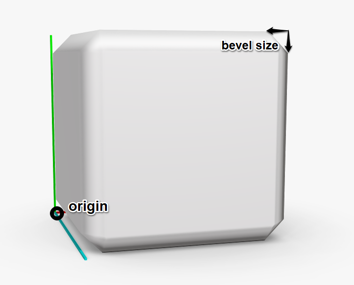

---

#### AddCylinder

`(radiusBottom: float, radiusTop: float, height: float, faces: Integer) : void`

**`AddCylinder`**

`(radiusBottom: float, radiusTop: float, height: float, faces: Integer, uvScale: Vector2f, uvRotation: float, uvOffset: Vector2f, [bevelSize : float = 2]) : void`
Adds a cylinder or cone (based on if the two radii are same or different). Its origin is in the center of the bottom base.

Parameters:

- `radiusBottom` radius of the bottom base
- `radiusTop` radius of the top
- `height` height (distance of bottom and top)
- `faces` number of faces that form the prism approximating the cylinder (3 - triangular prism, 6 - hexagonal prism etc.)
- `uvScale` multiply UV values of the vertices - the higher the value, the smaller the material
- `uvRotation` rotate UV values of the vertices, in a left-hand direction
- `uvOffset` increase UV values of the vertices -> moves the material in a negative direction
- `bevelSize` default 2, size of the cube's bevel (measured parallel to its walls)

Usage:

```javascript
AddCylinder(1000, 300, 2000, 32, Vector2f{1, 1}, 0, Vector2f{0, 0}, 100);
 SetObjSurface('isdt:white');
```

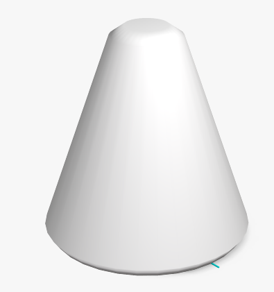

---

#### AddExternalMesh

`(meshId: String, boundingBoxSize: Vector3f, boundingBoxOffset: Vector3f) : void`

`(meshId: String, boundingBoxSize: Vector3f, boundingBoxOffset: Vector3f, uvScale: Vector2f, uvRotation: float, uvOffset: Vector2f) : void`

Instantiate a mesh stored in RAPI (the Rubens Admin database). Has an overload for modifying UV settings.

Parameters:

- `meshId` the ID of the mesh in a `catalogueId:meshName` pattern
- `boundingBoxSize` size of the bounding box of the mesh useful for measurements, camera position and preview cube
- `boundingBoxOffset` position of the bounding box
- `uvScale` multiply UV values of the vertices - the higher the value, the smaller the material
- `uvRotation` rotate UV values of the vertices, in a left-hand direction
- `uvOffset` increase UV values of the vertices -> moves the material in a negative direction

When performing an export from Blender with the Roomle Blender Addon, you will get a `txt` file with `AddExternalMesh` functions accompanying the files you will be uploading to Rubens Admin. You can also get the function from the RuAd mesh entry page.

---

#### AddMesh

`(vertices: [Vector3f], indices: [Integer], uvCoordinates [Vector2f], normals[Vector3f]) : void`

Creates a mesh from list of vertices and triangles. Overload for UV modifiers is available.

- Parameters:
- `vertices` list of the vertices
- `indices` list of indices of the vertices forming the triangles, following a left-hand thumb rule
  - ⚠️ length of the indices array must be divisible by 3
- `uvCoordinates` multiply UV values of the vertices - the higher the value, the smaller the material
  - ⚠️ length of the array must be the same as the length of the `vertices` array
- `normals` rotate UV values of the vertices, in a left-hand direction
  - ⚠️ length of the array must be the same as the length of the `vertices` array

Usage:

```javascript
n2 = 1 / sqrt(2);
n3 = 1 / sqrt(3);
AddMesh(
    Vector3f[
        /* 0 */{0, 0, 0},
        /* 1 */{300, 0, 0},
        /* 2 */{0, 300, 0},
        /* 3 */{0, 0, 300}
    ],
    [
        0, 1, 2,
        0, 3, 1,
        0, 2, 3
    ],
    Vector2f[
        /* uv coordinate of vertex 0 */{0, 0},
        /* uv coordinate of vertex 1 */{600, 0},
        /* uv coordinate of vertex 2 */{600, -600},
        /* uv coordinate of vertex 3 */{0, 600}
    ],
    Vector3f[
        /* normal of vertex 0 */{n3, n3, n3},
        /* normal of vertex 1 */{0, n2, n2},
        /* normal of vertex 2 */{n2, 0, n2},
        /* normal of vertex 3 */{n2, n2, 0}
    ]
);
SetObjSurface('demoCatalogId:grid');
```

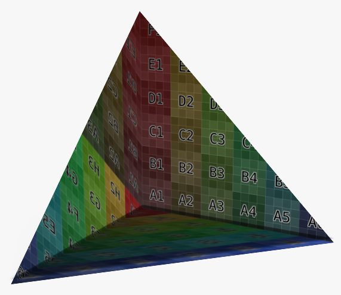

Creates a mesh from list of vertices, triangles, UV and normal coordinates.

---

**`AddMesh`**

`(vertices: [Vector3f]) : void`

Creates a mesh from a list of vertices, always creating a triangle between triplet or vertices. UV mapping is automatically computed.

Parameters:

- `vertices` list of the vertices
  - ⚠️ length of the vertices array must be divisible by 3

Usage:

```javascript
AddMesh(
    Vector3f[
        {0, 0, 0}, {300, 0, 0}, {0, 300, 0}, /* triangle in Z plane */
        {0, 0, 0}, {0, 0, 300}, {300, 0, 0}, /* triangle in Y plane */
        {0, 0, 0}, {0, 300, 0}, {0, 0, 300}  /* triangle in X plane */
    ]
);
 SetObjSurface('demoCatalogId:grid');
```

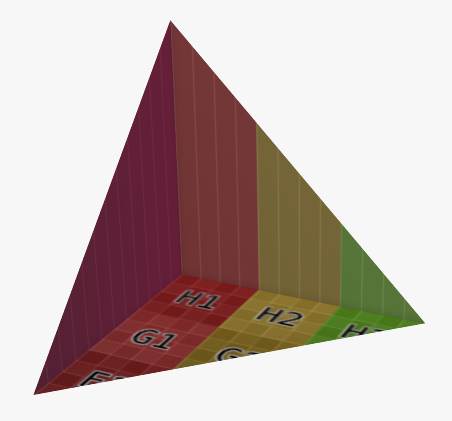

---

`(vertices: [Vector3f], indices: [Integer]) : void`

`(vertices: [Vector3f], indices: [Integer], uvScale: Vector2f, uvRotation: float, uvOffset: Vector2f) : void`

Creates a mesh from list of vertices and triangles. Overload for UV modifiers is available.

- Parameters:
- `vertices` list of the vertices
- `indices` list of indices of the vertices forming the triangles, following a left-hand thumb rule
  - ⚠️ length of the indices array must be divisible by 3
- `uvScale` multiply UV values of the vertices - the higher the value, the smaller the material
- `uvRotation` rotate UV values of the vertices, in a left-hand direction
- `uvOffset` increase UV values of the vertices -> moves the material in a negative direction

Usage:

```javascript
AddMesh(
    Vector3f[
        {0, 0, 0},   /* index 0, origin */
        {300, 0, 0}, /* index 1, right */
        {0, 300, 0}, /* index 2, forward */
        {0, 0, 300}  /* index 3, top */
    ],
    [
        0, 1, 2,  /* triangle in Z plane */
        0, 3, 1,  /* triangle in Y plane */
        0, 2, 3   /* triangle in X plane */
    ]
);
 SetObjSurface('demoCatalogId:grid');
```

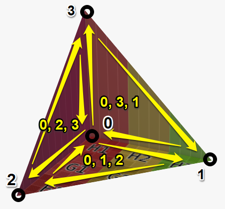

Creates a mesh from list of vertices, triangles, UV and normal coordinates.

---

#### AddPlainCube

`(size: Vector3f) : void`

A cube with sharp edges. A shortcut for an `AddCube` with bevel size of 0. Does not have overloads for UVs.

Usage:

```javascript
AddPlainCube(Vector3f{1000, 1000, 1000});
```

---

#### AddPrism

`(extrusionLength: float, vertices: [Vector2f]) : void`

**`AddPrism`**

`(extrusionLength: float, vertices: [Vector2f], uvScale: Vector2f, uvRotation: float, uvOffset: Vector2f, [bevelSize : float = 2]) : void`
Extrusion of a planar closed sketch in the Z direction. Bevel is not an actual geometric bevel like in cases of other primitive shapes, but is faked by adjustments of normals.

Parameters:

- `extrusionLength` length of the extrusion
- `vertices` list of vertices forming the sketch
- `uvScale` multiply UV values of the vertices - the higher the value, the smaller the material
- `uvRotation` rotate UV values of the vertices, in a left-hand direction
- `uvOffset` increase UV values of the vertices -> moves the material in a negative direction
- `bevelSize` default 2, size of the cube's bevel (measured parallel to its walls)

Usage: Example of a 90 degrees slice of a cirle.

```javascript
/* sine values for angles */
s0 = 0;
s15 = 0.2588190451;
s30 = 0.5;
s45 = 0.7071067812;
s60 = 0.8660254038;
s75 = 0.9659258263;
s90 = 1;
radius = 100;
AddPrism(
    100,
    Vector2f[
        {0, 0},
        {radius * s90, radius * s0},
        {radius * s75, radius * s15},
        {radius * s60, radius * s30},
        {radius * s45, radius * s45},
        {radius * s30, radius * s60},
        {radius * s15, radius * s75},
        {radius * s0, radius * s90}
    ]
);
 SetObjSurface('demoCatalogId:grid');
```

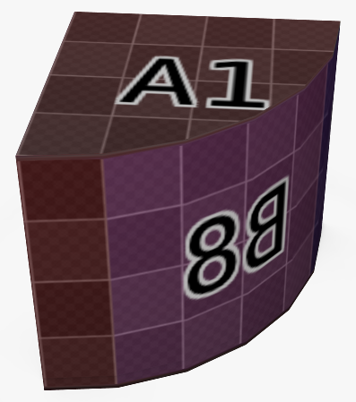

---

#### AddRectangle

`(size: Vector2) : void`

**`AddRectangle`**

`(size: Vector2f, uvScale: Vector2f, uvRotation: float, uvOffset: Vector2f) : void`

Adds an up facing flat quad in the ground plane with origin in its center.

Parameters:

- `size` size of the quad
- `uvScale` multiply UV values of the vertices - the higher the value, the smaller the material
- `uvRotation` rotate UV values of the vertices, in a left-hand direction
- `uvOffset` increase UV values of the vertices -> moves the material in a negative direction

---

#### AddSphere

`(size: Vector3f) : void`

**`AddSphere`**

`(size: Vector3f, uvScale: Vector2f, uvRotation: float, uvOffset: Vector2f) : void`

Adds an ellipsoid (sphere if all components are equal). Origin is in the center.

Parameters:

- `size` size of the cube
- `uvScale` multiply UV values of the vertices - the higher the value, the smaller the material
- `uvRotation` rotate UV values of the vertices, in a left-hand direction
- `uvOffset` increase UV values of the vertices -> moves the material in a negative direction

Usage:

```javascript
AddSphere(Vector3f{1000, 1000, 1000}, Vector2f{1, 1}, 0, Vector2f{0, 0});
 SetObjSurface('isdt:white');
```

---

#### Copy

`() : void`

Adds a copy of the last instantiated object and switches the target of all modifiers to this last instantiated object.

Usage:

```javascript
screws = 3;
width = 400;
spacing = width / (screws + 1);
offset = spacing / 2;

AddCube(Vector3f{400, 40, 10});
 SetObjSurface('isdt:gray');

BeginObjGroup('CREW + NUT + SHIM');
    /* shim */
    AddCylinder(14, 14, 1, 32, Vector2f{1, 1}, 0, Vector2f{0, 0}, 0);
     MoveMatrixBy(Vector3f{0, 0, -1});
    Copy();
     MoveMatrixBy(Vector3f{0, 0, 11});
    /* nut */
    AddCylinder(10, 10, 7, 6, Vector2f{1, 1}, 0, Vector2f{0, 0}, 0);
     MoveMatrixBy(Vector3f{0, 0, -8});
    Copy();
     MoveMatrixBy(Vector3f{0, 0, 19});
    /* screw */
    AddCylinder(3, 3, 14, 32);
     MoveMatrixBy(Vector3f{0, 0, -2});
EndObjGroup('SCREW + NUT + SHIM');
 SetObjSurface('demoCatalogId:chrome');
 MoveMatrixBy(Vector3f{spacing, 20, 0});

/* start with one, we already have the first screw */
for (i = 1; i < screws; i = i + 1) {
    Copy();
     MoveMatrixBy(Vector3f{spacing, 0, 0});
}
```

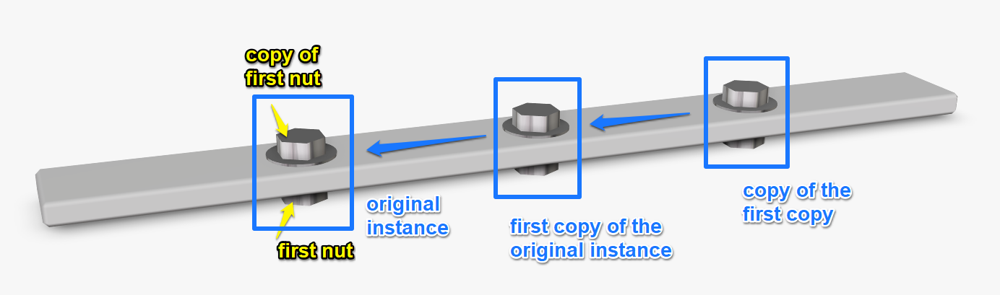

---

#### SubComponent

`(subComponentInternalId: String) : void`

Instantiates a geometry of the subComponent with its current values. The subComponent must have its `active` flag set to true. Any modifiers will apply to the whole subComponent geometry as if it was in a group.

For detailed explanation, refer to the [SubComponents](200_70_subcomponents.md) chapter.

Usage:

```json
"subComponents": [
    {
        "internalId": "SOFA",
        "active": "elementType == 'sofa'",
        "numberInPartList": 1,
        "assignments": {
            "material": "material_primary"
        }
    }
]
```

```javascript
if (elementType == 'SOFA') {
  SubComponent('SOFA');
}
```

---

### Modifiers

Modifiers are functions called after an object or object group. There are transformations (position, rotation and scale of the object), UV transformations (modify texture mapping) and set material. These functions are indented by an extra space.

Recommended order of transformations (and the most intuitive):

1. Scale
2. Rotate
3. Move

#### MoveMatrixBy

`(move: Vector3f) : void`

Applies translation transformation to the last object or group. The position will be added (not overriden) to any previous transformation.

Parameters:

- `move`: addition to the position vector of the last object or group

Usage:

```javascript
AddCube(Vector3f{1000, 1000, 1000});
 MoveMatrixBy(Vector3f{0, 0, 1000}); /* moves 1000 mm up*/
```

---

#### RotateMatrixBy

`(axis: Vector3f, origin: Vector3f, degrees: float) : void`

Applies the rotation transformation to the last object or group around a defined axis by an amount of degrees of angle in a clockwise direction. Hint: This is a left hand rule. If you place your left hand thumb in the direction of the axis, fingers will show the positive direction of the rotation.

Parameters:

- `axis`: a direction vector of the axis around which you rotate
- `origin`: a point definiing the position of the axis (together with `axis` defines the line)
- `degrees`: amount of rotation in degrees

Usage:

```javascript
AddCube(Vector3f{1000, 1000, 1000});
/* lifts the cube by its left side by 5 degrees */
/* axis goes forward through the lower right side edge */
 RotateMatrixBy(Vector3f{0, 1, 0}, Vector3f{1000, 0, 0}, 5);
```

---

#### ScaleMatrixBy`**()`(scale: Vector3f, [origin: Vector3f = Vectorf3{0, 0, 0}]) : vo

Applies a scale transform to the last object or group. Neutral value is 1.

Parameters:
`scale`: amount of scale to apply (multiply to previous, not override)
`origin`: pivot point of the scaling operation

Usage:

```javascript
AddCube(Vector3f{1000, 1000, 1000});
 ScaleMatrixBy(Vector3f{1, 1, 0.001}, Vector3f{0, 0, 1000}); /* scales the cube to 1 mm thickness, top surface of the cube stays in place */
```

---

#### SetObjSurface

`(materialId: String) : void`

Applies a material from RAPI to the last object or group.

Parameters:
`materialId`: string in format `catalogue:externalId` leading to an existing material entry in RAPI

Usage:

```javascript
AddCube(Vector3f{1000, 1000, 1000});
 SetObjSurface('isdt:black_transparent'); /* applies transparent black material to the cube */
```

#### SetObjSurfaceAttribute

`(attributeName: ['color', 'alpha', 'roughness', 'metallic'], attributeValue) : void`

Modifies the last object's material shader values. This is especially useful if you intend to have one normal map material which you can afterwards colourize in multiple possible colours.

Parameters:

- `attributeName`: either of `'color'`, `'alpha'`, `'roughness'`, `'metallic'` string values
- `attributeValue`:
  - `0.0f` to `1.0f` if `attributeName` is `alpha`, `rougness` or `metallic`
  - if attributeName is color, then a JavaScript compatible color definition, such as:
    - `#ffffff`
    - `rgb(255, 0, 128)`
    - `rgb(50%, 0%, 100%)`

Usage:

```javascript
AddSphere(Vector3f{1000, 1000, 1000});
 SetObjSurface('isdt:red');
 SetObjSurfaceAttribute('alpha', 0.5);
 SetObjSurfaceAttribute('color', '#00ff00'); // green
```

---

### UV Modifiers

Modifiers for UV transforms to modify the mapping of the material. These functions are indented by an extra space.

#### MoveUvMatrixBy

`(move: Vector2f) : void`

Addition to the mesh's UV coordinates. Positive values bring the texture to the left and to down on a cube.

Parameters:

- `move` the amount to move

Usage:

```javascript
AddCube(Vector3f{1000, 1000, 1000});
 SetObjSurface('demoCatalogId:grid');
 MoveUvMatrixBy(Vector2f{500, 100});
```

---

#### RotateUvMatrixBy

`(degrees: float) : void`

Rotation of the mesh's UV coordinates. Positive values rotatet the texture clockwise.

Parameters:

- `degrees` the amount to rotate

Usage:

```javascript
AddCube(Vector3f{1000, 1000, 1000});
 SetObjSurface('demoCatalogId:grid');
 RotateUvMatrixBy(45);
```

---

#### ScaleUvMatrixBy

`(scale: Vector2f) : void`

Multiplication of mesh's UV coordinates. Higher values make the texture smaller. Neutral value is 1.

Parameters:

- `scale` the amount to scale

Usage:

```javascript
AddCube(Vector3f{1000, 1000, 1000});
 SetObjSurface('demoCatalogId:grid');
 ScaleUvMatrixBy(Vector2f{2, 1});
```

---

#### SetUvTransform

`(uvScale: Vector2f, uvRotation: float, uvOffset: Vector2f : void`

Sets the UV trasnforms to a given values. This overrides any previous modifiers.

Parameters:

- `uvScale` multiply UV values of the vertices, neutral value is 1
- `uvRotation` rotate UV values of the vertices, in a left-hand direction
- `uvOffset` increase UV values of the vertices

---

### Grouping Functions

#### BeginObjGroup

`() : void`

Starts an object group. All further geometry objects until the `EndObjGroup();` call will be in the same group and will be affected by all other modifiers at once.

`BeginObjGroup();` will indent furher code by 4 spaces. Every `BeginObjGroup();` must match to an `EndObjGroup();`. Can be nested in any way and combined with `SubComponent` or CSG operator calls.

Parameters:

- there are no arguments, but it is a common to pass a String argument defining the name of the group, however this serves more like as a comment and is ignored by the core.

Usage:

```javascript
BeginObjGroup();
    AddCube(Vector3f{1000, 1000, 1000});
     SetObjSurface('isdt:blue');
    MoveMatrixBy(Vector3f{ -1000, 0, 0});
    AddSphere(Vector3f{1000, 1000, 1000});
     MoveMatrixBy(Vector3f{0, 0, 500});
     SetObjSurface('isdt:green');
EndObjGroup();
 SetObjSurface('isdt:red'); /* overrides colour of the objects in the group, all will be red */
 MoveMatrixBy(Vector3f{0, 500, 0});
/*
adds to the position of the objects in the group:
* cube is at {-1000, 500, 0}
* sphere is at {0, 500, 500}
*/
```

---

#### EndObjGroup

`() : void`

Closes the group started by BeginObjGroup. Removes 4 spaces from indentation.

---

### CSG Boolean Operators

These functions provide boolean operation on meshes. You can for example subtract a cylinder from a cube, making a hole through the cube.

⚠️ Those operators are expensive and should not be used unless a different approach can be utilized. They work best with primitives, the performance on meshes is not good.

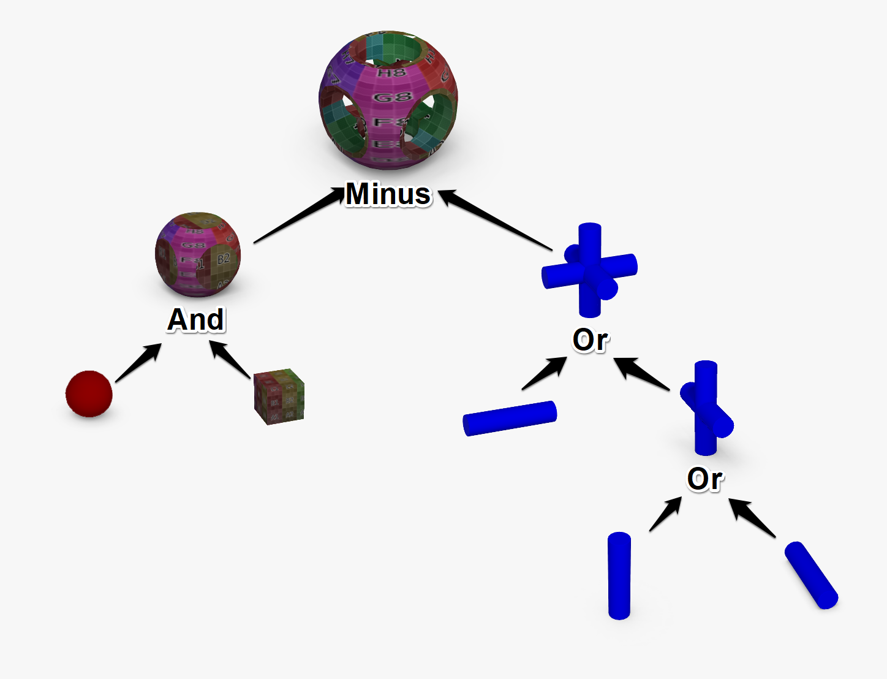

#### AndOperator

`() : void`

Interserction of the last two objects or meshes.

Usage:

```javascript
AddSphere(Vector3f{500, 500, 500});
AddCube(Vector3f{400, 400, 400}, Vector2f{5, 5}, 0, Vector2f{0, 0}, 0);
 MoveMatrixBy(Vector3f{ -400 / 2, -400 / 2, -400 / 2});
AndOperator();
```

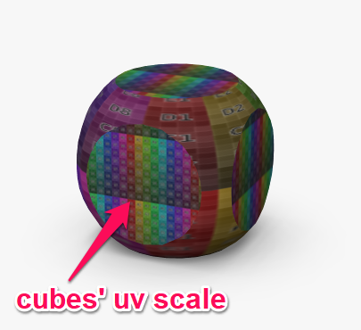

---

#### MinusOperator

`() : void`

Subtracts the geometry of the last object from the penultimate object. Intersection plane will have imprinted the last object's UV map values.

Usage:

```javascript
AddSphere(Vector3f{500, 500, 500});
AddCube(Vector3f{400, 400, 400}, Vector2f{5, 5}, 0, Vector2f{0, 0}, 0);
 MoveMatrixBy(Vector3f{ -400 / 2, -400 / 2, -400 / 2});
MinusOperator();
```

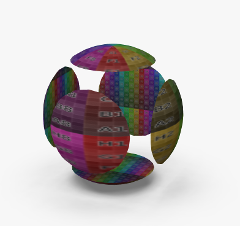

---

#### OrOperator

`() : void`

Union of two last geometry objects. Works similarily to an object group, but bakes the meshes in one, removing vertices inside the internal volume.

Usage:

```javascript
AddSphere(Vector3f{500, 500, 500});
AddCube(Vector3f{400, 400, 400}, Vector2f{5, 5}, 0, Vector2f{0, 0}, 0);
 MoveMatrixBy(Vector3f{ -400 / 2, -400 / 2, -400 / 2});
MinusOperator();
```

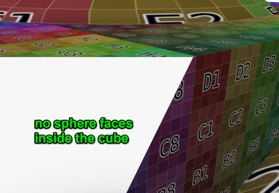

---

### Miscellaneous

#### hasEqualGeometry

---

## Tools and Importer Meta Keywords

The following features are ignored by the Roomle Rubens Configurator core, but provide different functionalities in other development tools and importers.

<!--
### #TABLE`**` parameterKey1, ..., parameterKe

Used by `roomle-content-tool-api` and the Roomle Component Formatter VS Code extension. Commented out, this will create an if-else structure of all possible combinations of values of given parameters.

Parameters:

- keys of parameters that have `validValues` or `valueObjects`

Usage:

````json
"parameters": [
    {
        "key": "type",
        "type": "String",
        "validValues": [
            "cube",
            "sphere"
        ]
    },
    {
        "key": "size",
        "type": "Decimal",
        "validValues": [
            100,
            200
        ]
    },
    {
        "key": "isMetal",
        "type": "Boolean",
        "validValues": [
            true,
            false
        ]
    }
]
````

````javascript
#TABLE type, size, isMetal
````

Becomes after applying format:

````javascript
/* TABLE type, size, isMetal */
if (type == "cube") {
  if (size == 100) {
    if (isMetal) {
    } else {
    }
  }
  if (size == 200) {
    if (isMetal) {
    } else {
    }
  }
}
if (type == "sphere") {
  if (size == 100) {
    if (isMetal) {
    } else {
    }
  }
  if (size == 200) {
    if (isMetal) {
    } else {
    }
  }
}
/* END OF TABLE type, size, isMetal */
````
-->

---

### TODO

A comment starting with TODO will appear in the VS Code Outline. This is a function provided by the VS Code extension and `roomle-content-tool-api`

Usage:

```javascript
// TODO add check for validity
```

---

### FIXME

A comment starting with FIXME will appear in the VS Code Outline. This is a function provided by the VS Code extension and `roomle-content-tool-api`

Usage:

```javascript
/* FIXME gap if size > 200 */
```

---

### #tag

This is used by the Roomle Component Tool extension for Visual Studio Code. This must be commented out, because it is unknown to the Roomle Core.

Defines a tag that will show in the Outline pane.

Usage:

```json
"onUpdate": "
    ...
    #tag THIS WILL APPEAR IN THE CODE OUTLINE
    ...
"
```

```json
"parentDockings": {
    "points": [
        {
            "mask": "
                #tag Top Left Connector
                'connector'
            ",
            "position": "{-width / 2, 0, height}"
        }
    ]
}
```

---

### #region and #endregion

This is used by the Roomle Component Tool extension for Visual Studio Code. This must be commented out, because it is unknown to the Roomle Core.

Defines a tag that will show in the Outline pane. Defines a code folding region for organizing code and displays the `#region` in the Outline pane in the same way as a [tag](#tag)

Usage:

```javascript
#region Docking variables
if (elementType == 'straight_left_armrest') {
    leftDock_allowed = false;
    rightDock_allowed = true;
    rightDock_position = Vector3f{520, 0, 0};
    ...
}
...
#endregion
```

---

### BEGIN CUSTOM CODE and END CUSTOM CODE

This is used by the IDM importer.

Commented out in the `onUpdate` script, provides an importer directive to keep the code in between those markers.

Usage:

```javascript
/* BEGIN CUSTOM CODE */
/* This code will remain after a reimport into this catalogue. */
if (isnull(inited)) {
  inited = true;
  myCustomVariable = 'some value';
}
myCustomVar_isLeather = idmFeature2 == 'LE';
/* END CUSTOM CODE */
```

---
