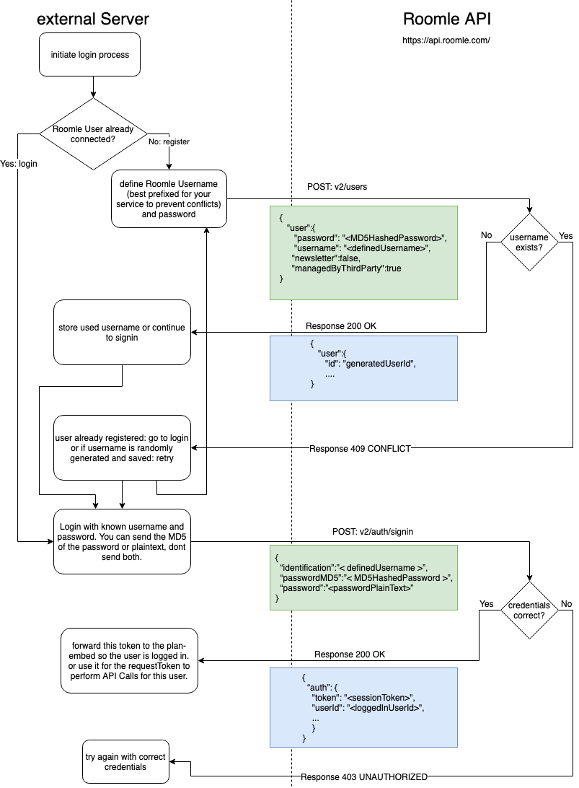

# Authentication

## Generation of the requestToken

Every call to the API must contain the following headers:

- apiKey : `<yourApiKey>`
- token: `<EncodingAlgorithmIdentifier>-<encodedRequestToken>`
- currentTenant: `<yourTenantId>`
- language: `<isoCode of the requested language>`

The requestToken is built by encoding the String

     <currentTimestamp>;<sessionToken>;<apiKey>

with the provided secret.

The timestamp must be formatted with the pattern yyyy-MM-dd'T'HH:mm:ss.SSSX

Possible encoding algorithms are:

- 01 : AES_CBC_PKCS5
- 02 : AES_ECB_PKCS5

When authenticated, the sessionToken is the one received from /v2/auth/signin.
For non-logged in users replace `<sessionToken>` with `anonymous`.

The encoded bytes must be base64 encoded for sending. To prevent problems in URLs (if the token is sent as a
query-param) you may replace ‘+’ with ‘-’ and ‘/’ with ‘_’.

An example of a correctly formatted token string:

`2020-12-31T23:00:00.000Z;aSessionToken;aValidApiKey`

An example of the above token encoded with the secret `a-Secr3t_Str1ng!`:

`02-jOi87tgUadH3EGwcs/FPR44LlPEVoayzgkkkzmMbPwz50gNngNxgX8aNmNZ1SMAy31j1qsB9RvlF1RxiILGYDQ==`

## POST /v2/auth/signin

Accepts: application/json

Generates: application/json

Body:

```json
{
    "identification": ",<emailaddress>",
    "password": "<passwordPlainText>"
}
```

The password may be provided as plain text. This is ok because transmition 
is done via https and rest assured, it will not be saved plain text but
strongly encrypted. 

Response success (200 OK):

```json
{
    "auth": {
        "token": "<sessionToken>",
        "userId": "<loggedInUserId>",
        "loginDate": "2018-06-25T07:27:16.456Z",
        "lastActionDate": "2018-06-25T07:27:16.456Z"
    }
}
```

Otherwise an according 4xx Response. f.e. 403 if the login failed.

## Sign-in flow

