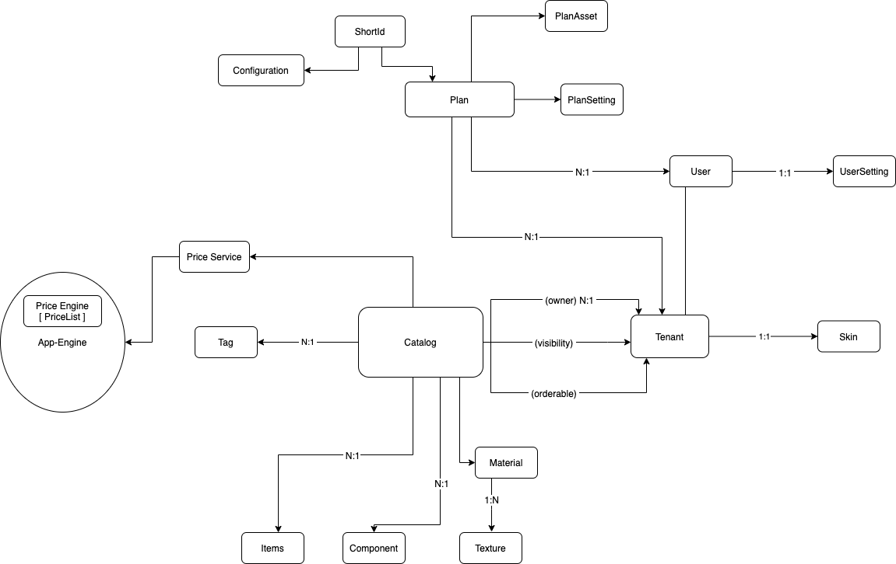

# RAPI Documentation

## Overview

## Usage Limits

Every tenant has a limit on their maximum number of catalogs and items in a catalog. That limit depends on the purchased package. If an item or catalog is created that would cross the limit, the call returns status 402.

## API Reference Index

* [Authentication](endpoints/authentication.md)
* [User](endpoints/user.md)
* [UserSettings](endpoints/usersettings.md)
* [Catalog](endpoints/catalog.md)
* [Item](endpoints/item.md)
* [Component](endpoints/component.md)
* [Plan](endpoints/plan.md)
* [PlanSnapshot](endpoints/plansnapshot.md)
* [Material](endpoints/material.md)
* [Texture](endpoints/texture.md)
* [PriceService](endpoints/priceservice.md)
* [Price](endpoints/price.md)
* [Mesh](endpoints/mesh.md)
* [Configuration](endpoints/configuration.md)
* [Tag](endpoints/tag.md)
* [ShortId](endpoints/shortid.md)
* [Configurator](endpoints/configurator.md)
* [Statistics](endpoints/statistics.md)

## Webhooks

For information about webhook, please check [here](webhook.md).
