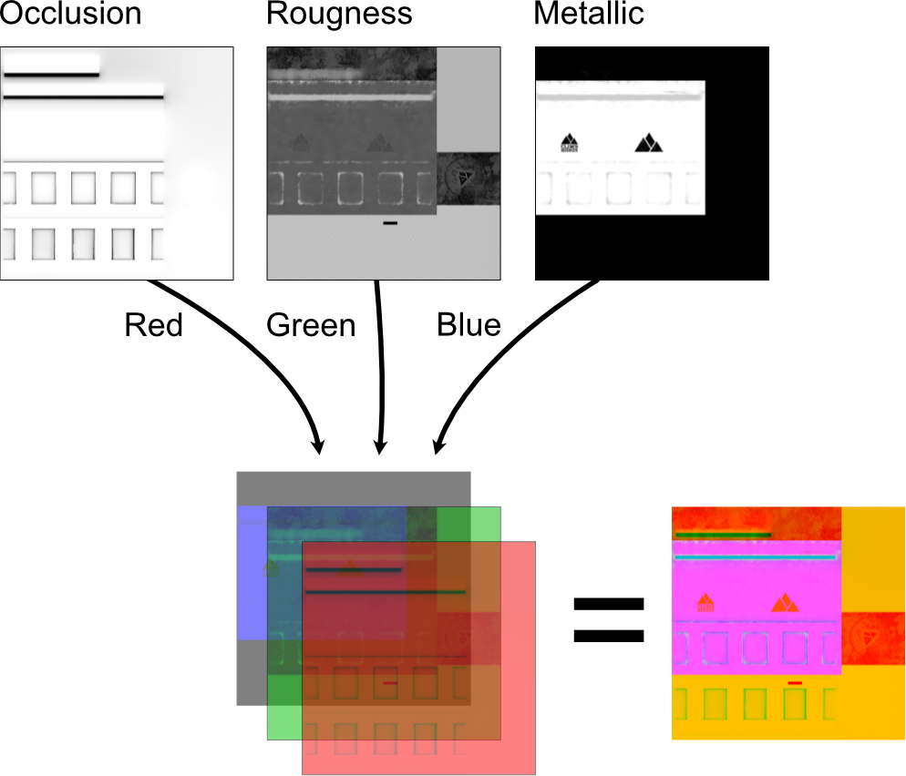

# Material & Textures Requirements

## Texture requirements & materials

### Overview

This page describes the basic concept of materials and texture maps and the way they define the look and feel of any 3D object in Roomle.

## Materials

A Roomle Material is a set of parameters which describe the physical properties of an object’s surface and define its appearance. Those parameters can either be numeric values or, in some cases, texture maps.

Roomle’s material system uses a Roughness-Metallic PBR (physically based rendering) model and the following parameters:

* Base color
* Alpha
* Ambient Occlusion
* Roughness
* Metalness
* Normal map
* Index of refraction

[Material properties in depth](../../content-creation/materialdefinition/)

### Textures

A texture map is an image applied (mapped) to the surface of a 3D object. This may be a .jpg or .png file.

You may provide the following texture map types:

* Base color (with optional alpha channel)
* Normal map
* Ambient Occlusion, Roughness and Metallic channels **in a combined map** (= ORM map). You can use the [ORM Converter](materials-and-texture-requirements.md#orm-converter) to create and preview the ORM map.

In order to repeatedly tile a texture across a surface, we need it to be seamless without special light effects, seams, boarders, artificial and blurry transitions, etc.

For details see [Texture requirements](../../content-creation/materialdefinition/#texture-json)

### Texture map requirements in depth

#### Texture Maps

You may provide the following texture map types:

* Base color (with optional alpha channel)
* Normal map
* Ambient Occlusion, Roughness and Metallic channels **in a combined map** (= ORM map). You can use the [ORM Converter](materials-and-texture-requirements.md#orm-converter) to create and preview the ORM map.

#### File Format

.jpeg or .png

#### Texture map size & resolution

The following rules must be followed so that a texture map will be displayed correctly in Roomle:

* The map’s pixel size needs to be a power of two (eg. 32, 64, 128, 256, 512, 1024, 2048, 4096, ... Pixel) along both sides.
* Both sides do not need to have the same length (eg. 2048 x 1024 px is acceptable).
* Provide the texture map’s real size to enable correct scaling on the 3D model (eg. 200 x 200 mm)
* Make use of non-square pixels if necessary. By providing the real size as shown above the texture map will be scaled to its correct dimensions on the model despite looking distorted when viewed as an image.

Recommended for best 3D quality visualization:

* Tileable 2048px x 2048px texture map
* Showing the smallest surface area possible to avoid visible tileable while retaining optimum visibility of small details.
  * There is no definitive answer on how small or large a texture map can or should be, as this always depends on the size of the texture's details. Fabric made of very fine threads or delicate minuscule ornaments will need greater resolution than materials that show bigger structures and should not look too repetitive. Wood would be an extreme example that will need bigger areas covered by its texture map trading detail resolution for a more realistic appearance from a distance.
  * Some examples:
    * Uniform fabric -> small area covered by texture map. Experience shows that 15 to 20 cm on the longer edge leads to good results
    * Smooth leather -> Medium texture map size. Little variance in diffuse color, but some variation in roughness / normal maps. We achieved great results with sizes of 50 - 80 cm
    * Natural Wood -> Large texture maps. Repetitive patterns would break the overall impression of the product. 1 x 2 m scaled to 2048 x 2048 (stretching the pixels along the wood grain's direction) is a well tested reference value in that case. Fine details would not be visible for obvious reasons, but viewed from a distance no repetition will be visible on most products.

For real-time rendering we automatically optimize the images

* Scaling
  * down to a platform specific maximum (currently 512 pixels for static items and 1024 pixels for configurable materials)
  * so that the pixel size is a power of two (eg. 32, 64, 128, 256, 512 or 1024 Pixel)
* A lossy image compression is applied.

.png>)

#### Seamless textures

In order to repeatedly tile a texture across a surface, we need it to be seamless without special light effects, seams, boarders, artificial and blurry transitions, etc.

#### Texture example images

.png>) .png>)

Texture with seams:

.png>)

Seamless texture:

.png>)

Non-tileable texture:

.png>)

Tileable texture\*:

.png>)

\* _To create tileable textures make sure that unique patterns match. If there are any distinctive elements, such as wood grains or fabric stamping, make sure that they are not repeating too often because then it is visible that the texture is tiled. This can be avoided by taking a texture sample of a bigger surface or by cloning away the obvious repeating elements, so that the effect can be reduced._

### Texture Mapping

#### Base Color Map

If a diffuse texture is present, its values will get multiplied (and thus darkened) with the base color values in linear color space.

For partial transparency you may provide an alpha channel (in a .PNG file). The alpha channel is used for opacity and multiplied with the opacity factor.

#### Normal map

[Normal maps](https://en.wikipedia.org/wiki/Normal\_mapping) can be used to add details / surface irregularities to materials without complicating the geometry.

Example:

.png>) .jpg>) .jpg>)

_Left to right: Normal Map; Render without normal map, Render with normal map_

Requirements:

* Tangent-space normals
* Right-handed coordinates (+X,+Y,+Z; OpenGL standard)

#### Combined Occlusion Roughness and Metallic texture

If you want to provide maps for any of occlusion, roughness or metallic values, you have to combine them into a single image with the following channel mapping

* Red channel: occlusion
* Green channel: roughness
* Blue channel: metallness

Illustration:

* The occlusion channel is multiplied with the material's [occlusion strength value](../../content-creation/materialdefinition/#occlusion-strength).
* The roughness channel is multiplied by the material's [roughness value](../../content-creation/materialdefinition/#roughness) (_this means that a material can be made shinier by entering a roughness value < 1.0 but not rougher!_).
* The metallic value is multiplied by the material's [metallic value](../../content-creation/materialdefinition/#metallic).

If you cannot provide all three channels, leave the the unused channel at the following default values:

* Red-occlusion: 1.0 (complete white)
* Green-roughness: 1.0 (complete white)
* Metallic: 0.0 (complete black)

Note: This is similar to the mapping in the [glTF 2.0 specification](https://github.com/KhronosGroup/glTF/tree/master/specification/2.0)

For details on the available properties take a look at the [Material Definition - Mapping](../../content-creation/materialdefinition/#mapping).

### ORM Converter

Open the [ORM Converter](https://www.roomle.com/t/orm/) and drag and drop the textures on the provided fields `Occlusion`, `Roughness` and `Metallic`. The combined ORM map shows up below. Download the file and upload it in Rubens Admin if the resulting map fits your needs.
